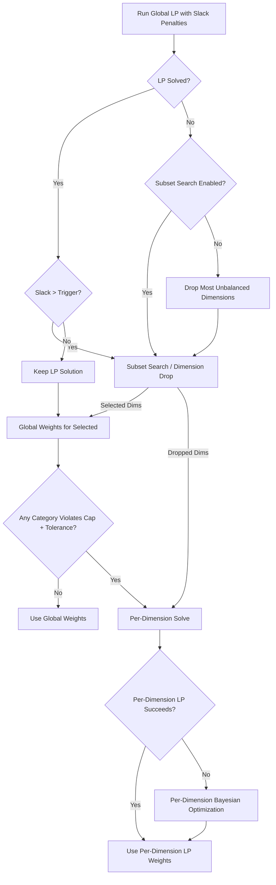

# Privacy-Compliant Peer Benchmark Tool

**Status: Production-ready. Configuration-driven architecture with preset system.**

## What is This Tool?

The Privacy-Compliant Peer Benchmark Tool is a sophisticated dimensional analysis system designed to compare financial entities (banks, issuers, merchants) against their peer groups while strictly enforcing Mastercard privacy compliance rules (Control 3.2). The tool enables you to understand how a target entity performs across multiple business dimensions without compromising the confidentiality of individual peer performance.

**Features**: Configuration-driven architecture with YAML presets for simplified command-line usage and reusable analysis configurations.

### Business Value

**For Strategic Analysis:**
- Compare your institution's performance against competitors across multiple dimensions (transaction types, card products, regions, etc.)
- Identify areas where you lead the market and areas needing improvement
- Understand market structure and peer distributions without requiring a specific benchmark target

**For Compliance:**
- Automatically enforces Mastercard Control 3.2 privacy rules
- Prevents single peer concentration from dominating benchmarks
- Provides full audit trails and transparency reports
- Validates privacy constraints across all dimensions and time periods

**For Decision Making:**
- Best-in-Class (BIC) percentile benchmarks show top-tier performance targets
- Balanced Peer Averages provide fair comparisons adjusting for market concentration
- Multi-dimensional insights reveal patterns across products, channels, geographies, and time

**Result Tracking:**
All weight calculations tracked in Weight Methods tab with exact method used:
- **`Global-LP`**: Dimension uses global weights from successful full-set LP
- **`Per-Dimension-LP`**: Dimension was removed from global set; solved with strict per-dimension LP
- **`Per-Dimension-Bayesian`**: Per-dimension LP failed; fallback Bayesian optimization used

**Configuration-Driven Architecture:**
- **Preset System**: Pre-configured YAML files for common analysis scenarios (compliance_strict, balanced_default, strategic_consistency, research_exploratory)
- **Configuration Hierarchy**: Defaults → Preset → Custom Config → CLI Arguments
- **Config Subcommand**: `benchmark config list|show|validate|generate` for exploring and managing configurations
- **Auto-Determined Privacy Rules**: Privacy caps (4/35, 5/25, 6/30, 7/35, 10/40) automatically determined from peer count
- **Enhanced Maintainability**: Clean separation between business logic and configuration
- **Volume-Weighted Penalties**: optimization feature that prioritizes compliance in high-volume categories while accepting violations in low-impact categories

**Key Features:**
- **Peer-only mode**: Analyze peer distributions and market structure without specifying a target entity
- **Multi-rate analysis**: Simultaneously analyze approval rates and fraud rates in a single run with shared privacy-compliant weights
- **Time-aware consistency**: Global weights work across all time periods and categories, ensuring temporal consistency
- **Bayesian optimization fallback**: When Linear Programming fails for a dimension, intelligent Bayesian optimization (L-BFGS-B) finds optimal weights while respecting privacy constraints
- **Enhanced weight tracking**: Weight Methods tab shows exact calculation method (Global-LP, Per-Dimension-LP, Per-Dimension-Bayesian) and multipliers for full transparency
- **Time-dimension output**: When `--time-col` is set, dimension sheets show metrics for each time-category combination plus aggregated "General" rows
- **Enhanced diagnostics**: Structural infeasibility analysis, subset search reporting, rank change tracking, and privacy validation sheets
---

## Table of Contents

- [Core Features](#core-features)
- [Understanding the Analysis Types](#understanding-the-analysis-types)
- [Installation](#installation)
- [Quick Start Guide](#quick-start-guide)
- [Input Data Requirements](#input-data-requirements)
- [Command-Line Interface](#command-line-interface)
- [Additional Documentation](#additional-documentation)

---

## Choosing the Right Preset

The tool uses presets to help you choose the right configuration for your business goal.

| Preset | Intent | Best For... | Trade-off |
|--------|--------|-------------|-----------|
| **`compliance_strict`** | "I cannot have any privacy violations." | Regulatory reporting, external audits | May drop dimensions (calculate them separately), leading to different weights for different parts of the report. |
| **`strategic_consistency`** | "I need one set of weights for all dimensions." | Strategic analysis, executive dashboards | Will allow privacy violations in specific categories, but minimizes their business impact using volume-weighted penalties. |
| **`balanced_default`** | "I want a good report with minimal fuss." | Day-to-day analysis | Good balance. Allows very small violations (2%) before dropping dimensions. |
| **`research_exploratory`** | "This dataset is difficult, just give me numbers." | Data exploration, difficult datasets | Lower rank preservation, higher weight bounds. |

---

## Core Features

### Privacy Compliance

**Built-in Privacy Enforcement**: Automatically applies Mastercard Control 3.2 peer concentration caps
- **With target entity**: Peer count = unique entities - 1 (excludes target)
- **Peer-only mode**: Peer count = unique entities (all are peers)
- **Cap thresholds**:
  - ≥10 peers → 40%
  - 7–9 peers → 35%
  - 6 peers → 30%
  - 5 peers → 25%
  - 4 peers → 35%
  - <4 peers → 50% (warning: below minimum for compliance)
- Prevents any single peer from dominating the benchmark calculation
- Applied per category within each dimension after weighting adjustments

**Global Consistent Weighting** (optional): Calculates one set of peer weights that work across all dimensions
- Uses Linear Programming (LP) with rank-preserving objective to find optimal weights
- Ensures privacy compliance in every category of every dimension simultaneously
- Maintains consistency across time periods when `--time-col` is specified
- Automatic fallback to Bayesian optimization (L-BFGS-B) when LP is structurally infeasible
- Includes tolerance modeling via slack variables with configurable penalties

#### Understanding Optimization Parameters

The relationship between `tolerance`, `slack`, and `volume_weighting` can be confusing. Here is the intuitive hierarchy:

**1. The Gatekeeper: `tolerance`**
*   **What it is:** The "acceptable margin of error" for privacy rules.
*   **How it works:** If a privacy cap is 25% and `tolerance` is 5.0, the effective limit is 30%.
*   **Role:** It decides whether a solution is "good enough" or if we need to try harder (by dropping dimensions or running per-dimension optimization).
*   **Rule of Thumb:**
    *   `0.0`: "I need perfect compliance." (Regulatory)
    *   `2.0`: "I can accept tiny rounding errors." (Standard)
    *   `25.0+`: "I just want a feasible solution, even if it violates rules." (Strategic)

**2. The Pressure Valve: `slack`**
*   **What it is:** A mechanism that allows the solver to "cheat" slightly when a problem is mathematically impossible.
*   **How it works:** Instead of failing with "Infeasible," the solver adds a "slack variable" to the constraint.
*   **Role:** It prevents the tool from crashing on difficult data.
*   **Penalty:** The solver hates using slack. It is penalized heavily (`lambda`).

**3. The Director: `volume_weighted_penalties`**
*   **What it is:** A rule that tells the solver *where* it is allowed to cheat.
*   **How it works:**
    *   **Disabled:** "A violation is a violation. I don't care if it's in a $1M category or a $1B category."
    *   **Enabled:** "If you must violate, do it in the tiny categories. Protect the big ones at all costs."
*   **Role:** Minimizes the *business impact* of violations when they are unavoidable.

**The Optimization Flow:**


**How the Algorithm Works:**

1.  **Global Attempt**: The tool first tries to find a single set of weights for *all* dimensions using Linear Programming (LP), allowing for controlled "slack" (violations) if necessary.
2.  **Feasibility Check**:
    *   If the LP fails or uses too much slack, the tool triggers a **Subset Search**.
    *   It identifies the largest group of dimensions that *can* work together globally ("Selected Dims") and drops the rest ("Dropped Dims").
3.  **Validation**:
    *   For the "Selected Dims", it calculates global weights.
    *   It then strictly validates every category. If any category still violates privacy rules (due to slack), that specific dimension is flagged for individual solving.
4.  **Per-Dimension Fallback**:
    *   Any "Dropped Dims" or dimensions with validation errors are solved individually.
    *   **Tier 2 (LP)**: It tries a strict per-dimension LP solve.
    *   **Tier 3 (Bayesian)**: If strict LP fails, it falls back to Bayesian Optimization to minimize violations while preserving data structure.

#### Volume-Weighted Slack Penalties

**Purpose**: Prioritize privacy compliance in high-volume categories while accepting violations in low-volume categories where business impact is minimal.

**How It Works**:
- **Traditional approach**: All slack penalties are uniform (`lambda = 100/tolerance` for every constraint)
- **Volume-weighted approach**: Penalty for each constraint is proportional to that category's total volume
- **Formula**: `penalty[category, peer] = base_lambda × (category_volume / total_volume) ^ exponent`
- **Effect**: Optimizer works harder to avoid violations in high-volume categories, accepts violations in low-volume categories

**Configuration**:
```yaml
optimization:
  linear_programming:
    tolerance: 25.0  # Allow violations
    volume_weighted_penalties: true  # Enable volume-weighting
    volume_weighting_exponent: 1.5  # Strong emphasis on large volumes
```

**Exponent Tuning**:
- **0.5** (square root): Gentle emphasis on large volumes
- **1.0** (linear): Proportional to volume
- **1.5**: Stronger emphasis on large volumes (Recommended for Strategic Consistency)
- **2.0** (quadratic): Very strong emphasis on large volumes

**When to Use**:
1. **Global weights are essential**: You want ONE set of weights across all dimensions (no dimension dropping)
2. **Privacy is structurally infeasible**: Some violations are unavoidable even with high tolerance
3. **Business impact varies**: Violations in small-volume categories don't matter much
4. **Smart trade-offs needed**: You want to minimize total business impact, not just violation count

**Trade-offs**:
- ✅ **Pro**: Violations occur where they matter least (small volume categories)
- ✅ **Pro**: Global weights retained across all dimensions
- ✅ **Pro**: Total business impact of violations is minimized
- ⚠️ **Con**: Some categories may have larger violations in percentage terms
- ⚠️ **Con**: Not suitable if all categories are equally important regardless of volume

**Available Presets**:
- `strategic_consistency`: Has volume-weighting **enabled** by default
- All other presets: Volume-weighting **disabled** by default

### Transparency and Diagnostics

**Weight Methods Tab**: Shows exactly how weights were calculated for each dimension
- Identifies which method succeeded: Global-LP, Per-Dimension-LP, Per-Dimension-Bayesian, or Global Weights (dropped)
- Displays the actual multiplier applied to each peer
- Enables auditing and validation of the weighting methodology
- New in v2.1: Tracks Bayesian optimization fallback when LP fails

**Subset Search Tab**: When searching for feasible global dimension subsets, records:
- Every attempted dimension combination
- Success/failure status and reasons
- Slack usage statistics (how much privacy caps were relaxed)
- Enables understanding of which dimension combinations are feasible together

**Structural Diagnostics**: Quantifies fundamental infeasibility drivers
- Structural Summary: Per-dimension counts of infeasible categories and worst margins
- Structural Detail: Row-level analysis showing which specific peer-category combinations are structurally impossible
- Helps decide whether to merge categories, relax bounds, or exclude dimensions

**Rank Changes**: Tracks how privacy adjustments affect peer ordering
- Shows baseline rank (by raw volume) vs adjusted rank (after privacy weights)
- Identifies which peers moved up or down and by how many positions
- Summary section highlights top movers by absolute rank delta

**Privacy Validation Sheet** (debug mode): Detailed compliance verification
- Shows original and balanced volume shares for every peer in every dimension-category-(time) combination
- Displays compliance status, privacy cap, tolerance, and violation margins
- Violations highlighted in red for immediate identification
- Enables granular validation that privacy rules are satisfied across all breaks

**Rich Excel Output**: Professional reports with multiple analytical sheets
- Summary sheet with metadata, inputs, and key findings
- One sheet per dimension with target vs peer comparisons
- Debug sheets showing unweighted metrics before privacy adjustments
- Full audit trail for regulatory and compliance review

---

## Understanding the Analysis Types

### Share Analysis: Volume Distribution

Share analysis examines how transaction volumes are distributed across dimensional categories. It answers questions like:
- "What percentage of total transaction volume occurs in each product category?"
- "How does our entity's distribution compare to the peer group?"

**What It Measures:**
- Your entity's share (%) in each category
- Balanced Peer Average share (%) after privacy adjustments
- Best-in-Class (BIC) performance at the 85th percentile
- Gap between your performance and peer benchmarks

**When to Use:**
- Understanding market positioning across product lines, channels, or regions
- Identifying over-indexed or under-indexed segments
- Strategic planning for market expansion or optimization

**Metrics Supported:**
- `transaction_count` (or alias `txn_count`): Number of transactions
- `transaction_amount` (or alias `tpv`): Total transaction value

**Example Output:**
```
Dimension: flag_domestic
Category        Target  Peer Avg  BIC    Gap
Domestic        65.3%   58.2%     68.1%  +7.1pp
International   34.7%   41.8%     31.9%  -7.1pp
```

This shows the entity is over-indexed in domestic transactions (+7.1pp above peer average) and under-indexed internationally.

### Rate Analysis: Approval and Fraud Rates

Rate analysis examines approval rates (percentage of transactions approved) and fraud rates (percentage of approved transactions that are fraudulent). It answers questions like:
- "Is our approval rate competitive with industry peers?"
- "Are we experiencing higher fraud rates than the peer group?"

**What It Measures:**
- Your entity's rate (%) in each category
- Balanced Peer Average rate (%) after privacy adjustments
- Best-in-Class (BIC) performance benchmarks:
  - Approval rate: 85th percentile (higher is better)
  - Fraud rate: 15th percentile (lower is better)
- Gap between your performance and peer benchmarks

**When to Use:**
- Evaluating authorization strategy effectiveness
- Benchmarking fraud detection and prevention performance
- Identifying dimensional segments with optimization opportunities
- Comparing performance across product types, channels, or risk segments

**Components Required:**
- `--total-col`: Denominator (total transactions or total approved)
- `--approved-col`: For approval rate analysis (optional if fraud-only)
- `--fraud-col`: For fraud rate analysis (optional if approval-only)
- Both can be specified for simultaneous multi-rate analysis

**Example Output (Approval Rate):**
```
Dimension: card_type
Category      Target  Peer Avg  BIC    Gap
Credit        89.2%   87.5%     91.3%  +1.7pp
Debit         92.8%   90.1%     94.2%  +2.7pp
Prepaid       85.4%   86.8%     89.6%  -1.4pp
```

**Example Output (Fraud Rate):**
```
Dimension: card_type
Category      Target  Peer Avg  BIC    Gap
Credit        0.34%   0.28%     0.15%  +0.06pp
Debit         0.19%   0.21%     0.10%  -0.02pp
Prepaid       0.42%   0.35%     0.18%  +0.07pp
```

#### Multi-Rate Analysis

Analyze both approval and fraud rates simultaneously by specifying both `--approved-col` and `--fraud-col`.

**Key features:**
- **Shared weights**: Privacy-constrained weights are calculated ONCE based on the shared denominator (`--total-col`)
- **Single Excel file**: Both rate types combined in one report with side-by-side columns in each dimension sheet
- **Combined dimension sheets**: Each dimension shows both approval and fraud metrics together for easy comparison
  - Approval columns: `Approval_Entity_Rate`, `Approval_Peer_Avg`, `Approval_Peer_BIC`, `Approval_Gap`
  - Fraud columns: `Fraud_Entity_Rate`, `Fraud_Peer_Avg`, `Fraud_Peer_BIC`, `Fraud_Gap`
  - Color-coded headers: Green for approval metrics, orange for fraud metrics

### Peer-Only Mode: Market Landscape Analysis

Peer-only mode analyzes the collective peer group without comparing to a specific target entity. It answers questions like:
- "How is transaction volume distributed across peers in each category?"
- "What does the competitive landscape look like?"
- "What are the peer concentration levels before privacy adjustments?"

**What It Measures:**
- Balanced Peer Average (%) across all peers
- Distribution statistics (10th, 25th, 50th, 75th, 90th percentiles)
- Best-in-Class (BIC) performance benchmarks
- No target-specific comparisons

**When to Use:**
- Exploratory analysis before selecting a benchmark target
- Understanding overall market structure and concentration
- Establishing baseline benchmarks for reporting
- Academic or research analysis without a specific entity focus

**How to Use:**
- Simply omit the `--entity` parameter from your command
- All entities in the dataset are treated as peers
- Output files named with `PEER_ONLY` identifier

**Key Differences from Target Mode:**
- Peer count = total unique entities (not unique entities - 1)
- No target columns in output: `target_share`, `target_rate`, `target_rank`, `delta`
- All dimensional analysis focuses on peer distributions only

### Secondary Metrics Analysis

Secondary metrics allow you to analyze additional metrics using the same privacy-constrained weights derived from the primary metric.

**Benefits:**
- Efficiently analyze multiple metrics (e.g., transaction count AND amount) without recalculating weights
- Ensures consistency across all metrics in the analysis
- Output includes a dedicated summary sheet for all secondary metrics
- Available for both Share and Rate analysis modes

---

## Input Data Requirements

### Overview

The tool accepts aggregated transactional data in CSV format (SQL support available via configuration). Data must be pre-aggregated by entity and dimensions - the tool does not aggregate raw transactions.

**Key Concept**: Each row represents the performance of one entity in one specific dimensional combination. For example:
- Row 1: Bank A, Domestic, Card Present, 1000 transactions
- Row 2: Bank A, Domestic, Card Not Present, 500 transactions
- Row 3: Bank A, International, Card Present, 200 transactions
- etc.

### Data Normalization

The `DataLoader` automatically normalizes column names for consistency:
- Converts to lowercase
- Replaces spaces with underscores
- Maps common aliases to standardized names

All column mappings are defined in `utils/config_manager.py`. You can extend these mappings if your data uses different column names.

### Required Columns

#### For SHARE Analysis

**Entity Identifier Column:**
- **Purpose**: Identifies each entity (bank, issuer, merchant)
- **Default name**: `issuer_name`
- **Can override** with `--entity-col` parameter
- **Data type**: String
- **Example values**: "BANCO SANTANDER", "ITAU UNIBANCO", "BRADESCO"

**Metric Column (choose one):**

1. **Transaction Count** (for count-based share analysis):
   - **Data type**: Integer (positive)
   - **Represents**: Number of transactions in this entity-dimension combination
   - **Use CLI parameter**: `--metric transaction_count` or `--metric txn_cnt`

2. **Transaction Amount** (for value-based share analysis):
   - **Data type**: Float/Decimal (positive)
   - **Represents**: Total monetary value of transactions (in any currency, but must be consistent)
   - **Use CLI parameter**: `--metric transaction_amount` or `--metric tpv`

#### For RATE Analysis

**Entity Identifier Column:** (same as share analysis above)

**Total Column (Required):**
- **Purpose**: Denominator for rate calculation
- **Specified with**: `--total-col <column_name>`
- **Data type**: Integer (positive)
- **For approval rates**: Total transactions attempted
- **For fraud rates**: Total approved transactions
- **Example column names**: `total_count`, `auth_total`, `app_cnt`

**Numerator Column(s) (At least one required):**

1. **Approved Column** (for approval rate analysis):
   - **Purpose**: Numerator for approval rate calculation
   - **Specified with**: `--approved-col <column_name>`
   - **Recognized aliases**: `appr_txns`, `approved_count`, `auth_approved`, `appr_count`
   - **Data type**: Integer (positive, ≤ total_col value)
   - **Represents**: Number of approved transactions (successful authorizations)
   - **Formula**: Approval Rate = approved_count / total_count × 100%
   - **Example**: If total=1000 and approved=850, approval rate = 85%

2. **Fraud Column** (for fraud rate analysis):
   - **Purpose**: Numerator for fraud rate calculation
   - **Specified with**: `--fraud-col <column_name>`
   - **Recognized aliases**: `fraud_cnt`, `qt_fraud`, `fraud_tran`
   - **Data type**: Integer (positive, ≤ total_col value for fraud rates)
   - **Represents**: Number of fraudulent transactions (detected frauds)
   - **Formula**: Fraud Rate = fraud_count / approved_count × 100%
   - **Example**: If approved=850 and fraud=7, fraud rate = 0.82%

**Note on Multi-Rate Analysis:**
- You can specify **both** `--approved-col` and `--fraud-col` in the same command
- The tool performs both analyses simultaneously with shared privacy weights
- Results are combined in a single Excel file with side-by-side metrics
- Privacy constraints based on the shared denominator ensure consistency

### Dimensional Columns

**Purpose**: Define business dimensions for breakdown analysis (product types, channels, regions, risk segments, etc.)

**How to specify**:
- **Auto-detection**: Use `--auto` flag to automatically analyze all non-metric, non-entity columns
- **Manual selection**: Use `--dimensions col1 col2 col3` to specify exact columns

**Data type**: String or Integer (categorical values)

**Common Examples**:
- `flag_domestic`: Domestic vs International (values: "D", "I" or "Domestic", "International")
- `cp_cnp`: Card Present vs Card Not Present (values: "CP", "CNP")
- `card_type`: Card product type (values: "CREDIT", "DEBIT", "PREPAID")
- `merchant_category`: MCC categories (values: "GROCERIES", "FUEL", "RESTAURANTS")
- `product_group`: Product groupings (values: "PREMIUM", "STANDARD", "BASIC")
- `risk_segment`: Risk-based segments (values: "LOW_RISK", "MEDIUM_RISK", "HIGH_RISK")
- `channel`: Transaction channel (values: "POS", "ECOMMERCE", "ATM", "MOBILE")
- `ano_mes` or `year_month`: Time period (values: "2024-01", "2024-02", etc.)

**Best Practices**:
- Use clear, descriptive values
- Keep categories mutually exclusive within each dimension
- Avoid too many categories (>20) in a single dimension as it may cause privacy constraint issues
- If using time dimensions with `--time-col`, ensure the time column uses sortable values

### Optional: Time Column

**Purpose**: Enable time-aware consistency for analyses spanning multiple time periods

**Specified with**: `--time-col <column_name>`

**Common names**: `ano_mes`, `year_month`, `month`, `period`, `date`

**Data type**: String or Date (must be sortable)

**Format examples**:
- `2024-01`, `2024-02`, `2024-03` (YYYY-MM format)
- `202401`, `202402`, `202403` (YYYYMM format)
- `2024Q1`, `2024Q2` (quarterly)
- `Jan-2024`, `Feb-2024` (month-year)

**When to use**:
- Analyzing performance across multiple months/quarters
- Ensuring peer weights remain consistent across all time periods
- Creates constraints for both monthly totals and monthly category combinations

**Effect on output**:
- Dimension sheets include rows for each time-category combination
- Plus "General" aggregated rows showing overall performance across time
- Example: For dimension `card_type` and time periods Jan/Feb/Mar, you'll see:
  - CREDIT (Jan), CREDIT (Feb), CREDIT (Mar), CREDIT (General)
  - DEBIT (Jan), DEBIT (Feb), DEBIT (Mar), DEBIT (General)
  - etc.

### Example Data Structure

**Share Analysis Example (CSV):**
```csv
issuer_name,flag_domestic,cp_cnp,card_type,transaction_count,transaction_amount
BANCO SANTANDER,Domestic,CP,CREDIT,125000,15000000.00
BANCO SANTANDER,Domestic,CP,DEBIT,200000,8000000.00
BANCO SANTANDER,Domestic,CNP,CREDIT,80000,12000000.00
BANCO SANTANDER,International,CP,CREDIT,15000,3000000.00
ITAU UNIBANCO,Domestic,CP,CREDIT,180000,22000000.00
ITAU UNIBANCO,Domestic,CP,DEBIT,250000,10000000.00
```

**Rate Analysis Example (CSV):**
```csv
issuer_name,flag_domestic,card_type,total_count,approved_count,fraud_count
BANCO SANTANDER,Domestic,CREDIT,125000,108750,412
BANCO SANTANDER,Domestic,DEBIT,200000,186000,372
BANCO SANTANDER,International,CREDIT,15000,12000,78
ITAU UNIBANCO,Domestic,CREDIT,180000,162000,540
ITAU UNIBANCO,Domestic,DEBIT,250000,235000,475
```

### Data Quality Requirements

**Completeness:**
- All required columns must be present (will error if missing)
- No NULL values in entity identifier or metric columns
- Dimensional columns can have NULL/empty values (treated as a category)

**Consistency:**
- Currency must be consistent across all rows (tool doesn't convert currencies)
- Time formats must be consistent if using `--time-col`
- Entity names must be consistent (case-sensitive): "Santander" ≠ "SANTANDER"

**Granularity:**
- Data must be pre-aggregated (tool doesn't sum transaction-level records)
- Each row represents one entity × dimension1 × dimension2 × ... combination
- Typically monthly aggregates, but can be any consistent period

**Validation:**
- For rate analysis: approved_count ≤ total_count
- For fraud analysis: fraud_count ≤ approved_count (if fraud is of approved transactions)
- All counts/amounts must be non-negative
- At least 4 unique entities required for privacy compliance (warns if <4)

### Tips for Data Preparation

1. **Entity Naming**: Use consistent, official entity names. The tool is case-sensitive.
2. **Dimension Values**: Use short, clear codes rather than long descriptions (easier to read in reports).
3. **Aggregation Level**: Monthly aggregation is typical and works well with time-aware consistency.
4. **Missing Combinations**: If an entity-dimension combination has zero transactions, you can either:
   - Include it with 0 values (preferred for completeness)
   - Omit it (tool treats missing as zero)
5. **Currency**: If using `transaction_amount`, convert all values to a single currency before analysis.
6. **Preprocessing**: Remove test entities, invalid transactions, and outliers before aggregation.
7. **Dimension Cardinality**: Dimensions with 100+ categories may cause performance issues; consider grouping.

---

## Quick Start Guide

This section provides practical examples to get you started quickly. All examples use Windows PowerShell syntax, but they work on macOS/Linux with minor path adjustments (`\` → `/`).

### Basic Commands

**Note on Python Launcher**: These examples use `py` (Windows Python Launcher) which automatically uses the correct Python version. On macOS/Linux, use `python3` instead.

### Example 1: Basic Share Analysis with Auto-Detection

**Scenario**: You want to understand how Banco Santander's transaction volume is distributed across all available dimensions.

**Command:**
```powershell
py benchmark.py share `
  --csv data\sample.csv `
  --entity "BANCO SANTANDER" `
  --metric transaction_count `
  --auto
```

**What this does:**
- **`share`**: Runs share analysis (volume distribution)
- **`--csv data\sample.csv`**: Loads data from the specified CSV file
- **`--entity "BANCO SANTANDER"`**: Compares this entity against peers
- **`--metric transaction_count`**: Analyzes transaction count distribution
- **`--auto`**: Automatically detects and analyzes all dimensional columns

**Output**: Excel file with one sheet per dimension showing:
- Santander's share (%) in each category
- Balanced Peer Average (%) after privacy adjustments
- Best-in-Class (85th percentile)
- Gap from peer average

**File naming**: `benchmark_share_BANCO_SANTANDER_20241107_143022.xlsx`

---

### Example 2: Share Analysis with Manual Dimension Selection

**Scenario**: You only want to analyze specific dimensions (domestic/international, card present/not present, purchase type).

**Command:**
```powershell
py benchmark.py share `
  --csv data\sample.csv `
  --entity "BANCO SANTANDER" `
  --metric transaction_amount `
  --dimensions flag_domestic cp_cnp tipo_compra
```

**What this does:**
- Same as Example 1, but:
- **`--metric transaction_amount`**: Analyzes value (TPV) distribution instead of count
- **`--dimensions flag_domestic cp_cnp tipo_compra`**: Only analyzes these three dimensions

**When to use**: When you know exactly which dimensions matter for your analysis and want faster execution.

---

### Example 3: Peer-Only Mode (No Target Entity)

**Scenario**: You want to understand the overall peer landscape without comparing to a specific entity.

**Command:**
```powershell
py benchmark.py share `
  --csv data\sample.csv `
  --metric transaction_count `
  --auto
```

**What this does:**
- **No `--entity` parameter**: Treats all entities as peers
- Provides peer distribution statistics without target-specific comparisons
- Useful for market research and exploratory analysis

**Output differences**:
- No "Target" columns in dimension sheets
- Filename includes `PEER_ONLY` identifier
- Peer count = total unique entities (not unique entities - 1)

---

### Example 4: Approval Rate Analysis

**Scenario**: You want to benchmark Santander's approval rates across dimensions.

**Command:**
```powershell
py benchmark.py rate `
  --csv data\sample.csv `
  --entity "BANCO SANTANDER" `
  --total-col total_count `
  --approved-col approved_count `
  --auto
```

**What this does:**
- **`rate`**: Runs rate analysis mode
- **`--total-col total_count`**: Column with total transactions (denominator)
- **`--approved-col approved_count`**: Column with approved transactions (numerator)
- **`--auto`**: Analyzes all dimensions

**Formula**: Approval Rate = approved_count / total_count × 100%

**Output**: Shows approval rates with 85th percentile BIC (higher is better).

---

### Example 5: Fraud Rate Analysis

**Scenario**: You want to benchmark fraud rates to identify high-risk segments.

**Command:**
```powershell
py benchmark.py rate `
  --csv data\sample.csv `
  --entity "BANCO SANTANDER" `
  --total-col total_count `
  --fraud-col fraud_count `
  --auto
```

**What this does:**
- **`--fraud-col fraud_count`**: Column with fraud transactions
- Tool automatically uses 15th percentile BIC for fraud (lower is better)

**Formula**: Fraud Rate = fraud_count / total_count × 100%

**Interpretation**: Categories where you're below peer average and BIC are performing well.

---

### Example 6: Multi-Rate Analysis (Approval + Fraud Simultaneously)

**Scenario**: You want to analyze both approval and fraud rates in a single run for comprehensive insights.

**Command:**
```powershell
py benchmark.py rate `
  --csv data\sample.csv `
  --entity "BANCO SANTANDER" `
  --total-col total_count `
  --approved-col approved_count `
  --fraud-col fraud_count `
  --dimensions flag_domestic card_type
```

**What this does:**
- **Both `--approved-col` and `--fraud-col`**: Analyzes both rates simultaneously
- Single Excel file with combined sheets showing both metrics side-by-side in each dimension sheet
- Shared privacy-compliant weights ensure consistency
- Approval metrics in green, fraud metrics in orange (color-coded headers)

**Rationale:**
Since both approval and
 fraud rates share the same denominator (total transactions), using one set of privacy-constrained weights ensures fairness and consistency.

**Example:**
`powershell
py benchmark.py rate --csv data.csv --total-col txn_cnt --approved-col app_cnt --fraud-col fraud_cnt --dimensions dim1 dim2 dim3 --preset balanced_default --output multi_rate_report.xlsx
`

---

### Example 7: Time-Aware Consistency

**Scenario**: You're analyzing 3 months of data and want peer weights that remain consistent across all time periods.

**Command:**
```powershell
py benchmark.py share `
  --csv data\sample.csv `
  --entity "BANCO SANTANDER" `
  --metric transaction_count `
  --auto `
  --consistent-weights `
  --time-col ano_mes `
  --debug
```

**What this does:**
- **`--consistent-weights`**: Calculates one global set of peer weights
- **`--time-col ano_mes`**: Specifies the time period column
- **`--debug`**: Includes debug sheets (Peer Weights, original metrics)

**Result**: 
- Same peer weights applied across all months and all dimension-category-month combinations
- Dimension sheets show rows for each category-month combination plus "General" aggregates
- Privacy constraints satisfied in every month and every category of every dimension

**When to use**: Time-series analysis where you need temporal consistency in benchmarks.

---

### Example 8: Using Configuration Presets

**Scenario**: You want to run a conservative analysis with strict privacy enforcement.

**Command:**
```powershell
py benchmark.py share `
  --csv data\sample.csv `
  --entity "BANCO SANTANDER" `
  --metric transaction_count `
  --auto `
  --preset compliance_strict `
  --debug
```

**What this does:**
- **`--preset compliance_strict`**: Applies compliance_strict preset configuration
  - max_weight=5.0 (strict limit on peer reweighting)
  - tolerance=0.0 (strict privacy enforcement)
  - greedy subset search strategy
- All tuning parameters come from the preset file
- No need to specify individual optimization parameters on command line

**Available Presets:**
- `compliance_strict`: Regulatory Compliance - Zero tolerance for violations
- `balanced_default`: Standard Analysis - Balance of compliance and consistency
- `strategic_consistency`: Strategic Analysis - Global weights with minimized violations
- `research_exploratory`: Research - Maximum flexibility for difficult datasets

**View available presets:**
```powershell
py benchmark.py config list
```

**See preset details:**
```powershell
py benchmark.py config show compliance_strict
```

---

### Example 9: Custom Configuration File

**Scenario**: You have specific optimization requirements not covered by presets.

**Step 1: Generate a template configuration**
```powershell
py benchmark.py config generate --output my_config.yaml
```

**Step 2: Edit the YAML file** with your desired settings (e.g., max_weight=7.0, tolerance=1.5)

**Step 3: Run analysis with custom config**
```
  --output reports\santander_q1_analysis.xlsx `
  --debug
```

**What this does:**
- **`--config my_config.yaml`**: Loads your custom optimization parameters
- All tuning settings (max_weight, tolerance, volume_preservation, etc.) read from YAML
- Can still override output file name via CLI
- Reusable configuration for consistent analysis runs

**Configuration hierarchy:**
1. Hard-coded defaults
2. Preset (if --preset specified)
3. Custom config file (if --config specified) - **highest precedence**
4. CLI flags (only for essential params like --csv, --entity, --output)

---

### Example 10: Advanced Subset Search

**Scenario**: You have many dimensions and want automatic subset search with custom strategy.

**Create custom config with subset search enabled:**
```yaml
# my_subset_search.yaml
version: "3.0"
optimization:
  bounds:
    max_weight: 10.0
  linear_programming:
    tolerance: 1.0
  subset_search:
    enabled: true
    strategy: "random"  # Try random combinations
    max_tests: 500
    trigger_on_slack: true
    max_slack_threshold: 0.0
    prefer_slacks_first: false
```

**Command:**
```powershell
py benchmark.py share `
  --csv data\sample.csv `
  --entity "BANCO SANTANDER" `
  --metric transaction_count `
  --auto `
  --consistent-weights `
  --config my_subset_search.yaml `
  --debug
```

**What this does:**
- Automatically searches for largest feasible dimension subset
- Uses random search strategy (tests random combinations)
- Records all attempts in the Subset Search tab
- Up to 500 search attempts allowed

**Use case**: When full LP with all dimensions is infeasible, finds the best subset that works.

---

### Example 11: Time-Aware Analysis with Preset

**Scenario**: You're analyzing 3 months of data with strict privacy enforcement and want time-aware consistency.

**Command:**
```powershell
py benchmark.py share `
  --csv data\sample.csv `
  --entity "BANCO SANTANDER" `
  --metric transaction_count `
  --dimensions flag_domestic cp_cnp card_type `
  --consistent-weights `
  --time-col ano_mes `
  --preset compliance_strict `
  --output santander_time_series.xlsx
```

**What this does:**
- **`--preset compliance_strict`**: Uses strict zero-tolerance configuration
  - tolerance=0.0 (strict privacy enforcement)
  - volume_preservation=1.0 (maximum rank preservation)
  - random subset search strategy
  - debug mode enabled by default
- **`--time-col ano_mes`**: Time-aware constraints across all months
- One set of global weights works across all time periods and all categories
- Privacy constraints satisfied in every time-category combination

**When to use**: Time-series analysis requiring strict privacy compliance and temporal consistency.

---

### Example 12: Peer-Only Multi-Rate with Preset

**Scenario**: Analyze peer group approval and fraud trends without a target entity, using balanced settings.

**Command:**
```powershell
py benchmark.py rate `
  --csv data\monthly_data.csv `
  --total-col amt_total `
  --approved-col amt_approved `
  --fraud-col amt_fraud `
  --dimensions flag_recurring fl_token poi pan_entry_mode ticket_range txn_period `
  --time-col year_month `
  --preset balanced_default `
  --export-balanced-csv
```

**What this does:**
- **No `--entity`**: Peer-only mode
- **Both rate types**: Simultaneous approval and fraud analysis
- **Time-aware**: Consistent weights across all months
- **Multi-dimensional**: Analyzes product groups and domestic/international

**Output**: Comprehensive peer landscape report showing how approval and fraud rates vary across products, regions, and time.

---

### Example 13: Export Balanced CSV for External Analysis

**Scenario**: You want to export privacy-weighted balanced totals to CSV for importing into Tableau, PowerBI, or Python.

**Command:**
```powershell
py benchmark.py rate `
  --csv "data\carrefour_peer_group_cube.csv" `
  --total-col amt_total `
  --approved-col amt_approved `
  --fraud-col amt_fraud `
  --dimensions flag_recurring fl_token poi pan_entry_mode ticket_range txn_period `
  --time-col year_month `
  --preset compliance_strict `
  --export-balanced-csv `
  --output carrefour_prod_v0.xlsx
```

**What this does:**
- **`--export-balanced-csv`**: Generates a CSV file alongside the Excel report
- CSV contains: Dimension, Category, year_month (time column), Balanced_Total, Balanced_Approval_Total, Balanced_Fraud_Total
- All values are **privacy-weighted aggregates**: sum(peer_value × weight) across all peers
- CSV filename: `carrefour_prod_v0_balanced.csv`
- Works with both rate and share analysis
- Does NOT require `--debug` flag

**CSV Output Structure:**
```csv
Dimension,Category,year_month,Balanced_Total,Balanced_Approval_Total,Balanced_Fraud_Total
fl_token,Non-tokenized,2024-01,203796570874.8,151927893365.16,185177975.02
fl_token,Tokenized,2024-01,51780967982.85,38015274284.46,78836403.73
flag_recurring,0,2024-01,235661586627.14,182768557309.09,229570462.72
flag_recurring,1,2024-01,19915952230.51,7174610340.53,34443916.03
```

#### Use Cases

1. **Data Visualization**: Import into Tableau, PowerBI, or Looker for custom dashboards
2. **Statistical Analysis**: Load into Python (pandas), R, or SAS for further modeling
3. **Data Pipeline Integration**: Feed balanced aggregates into downstream systems
4. **Simplified Reporting**: Share privacy-compliant totals without exposing calculation details
5. **Time-Series Analysis**: Analyze trends across dimensions and time periods in specialized tools
6. **Cross-Tool Validation**: Verify Excel calculations independently in other platforms

#### Requirements

- Works automatically when the flag is enabled
- Does NOT require `--debug` flag
- Only works when privacy-constrained weighting is enabled (default behavior)
- If `--per-dimension-weights` is used, CSV reflects per-dimension weights
- Time column automatically included if `--time-col` is specified

#### CSV Validation

The tool includes a CSV validation script (`utils/csv_validator.py`) to verify that CSV balanced totals correctly produce the Excel rates:

```powershell
# Validate CSV against Excel report
py utils/csv_validator.py carrefour_prod_v0.xlsx carrefour_prod_v0_balanced.csv

# With custom tolerance
py utils/csv_validator.py report.xlsx report_balanced.csv --tolerance 0.001

# Verbose output showing all comparisons
py utils/csv_validator.py report.xlsx report_balanced.csv --verbose
```

The validator checks:
- Calculated rates from CSV totals match Excel dimension sheets
- All dimension-category-(time) combinations are validated
- Reports pass/fail/skip counts with detailed diagnostics

See `utils/csv_validator.py` for more details on validation methodology.

---

## Command-Line Interface

### Overview

The tool provides a configuration-driven CLI with three main commands:
- **`share`**: Share-based dimensional analysis (transaction volume distribution)
- **`rate`**: Rate-based dimensional analysis (approval rates, fraud rates)
- **`config`**: Configuration management (list, show, validate, generate presets)

**Version 3.0 Philosophy**: 
- Essential parameters remain as CLI flags (data source, entity, dimensions, output)
- Tuning parameters (max-weight, tolerance, volume-preservation, etc.) moved to YAML configuration files
- Presets provide reusable configurations for common analysis scenarios
- Configuration hierarchy: Defaults → Preset → Custom Config File → CLI Overrides

### Getting Help

```powershell
# General help and version
py benchmark.py --help
py benchmark.py --version

# Share analysis help
py benchmark.py share --help

# Rate analysis help
py benchmark.py rate --help

# Config management help
py benchmark.py config --help

# List available presets
py benchmark.py config list

# Show specific preset configuration
py benchmark.py config show compliance_strict
py benchmark.py config show balanced_default
```

### Configuration System

#### Presets
- **`--preset <name>`** (Optional)
  - Apply predefined configuration preset from `presets/` directory
  - Presets include: `compliance_strict`, `balanced_default`, `strategic_consistency`, `research_exploratory`
  - View available presets: `py benchmark.py config list`
  - Show preset details: `py benchmark.py config show <preset_name>`
  - Example: `--preset compliance_strict`
  - **Preset files** (YAML):
    - `compliance_strict.yaml`: max_weight=5.0, tolerance=0.0, greedy search
    - `balanced_default.yaml`: max_weight=10.0, tolerance=1.0, greedy search (default behavior)
    - `strategic_consistency.yaml`: max_weight=15.0, tolerance=5.0, random search
    - `research_exploratory.yaml`: Relaxed constraints for difficult datasets

#### Custom Configuration Files
- **`--config <path>`** (Optional)
  - Load custom YAML configuration file
  - Overrides built-in defaults
  - Can be combined with `--preset` (config file takes precedence)
  - Example: `--config my_analysis_config.yaml`
  - Generate template: `py benchmark.py config generate --output my_config.yaml`

**Configuration Hierarchy (lowest to highest precedence)**:
1. Hard-coded defaults in `config_manager.py`
2. Preset file (if `--preset` specified)
3. Custom config file (if `--config` specified)
4. CLI arguments (highest precedence, overrides all)

### General Parameters (Both Share and Rate)

These parameters apply to both share and rate analysis:

#### Data Source
- **`--csv <path>`** (Required)
  - Path to input CSV file
  - Can be absolute or relative path
  - Windows example: `--csv data\transactions.csv`
  - macOS/Linux example: `--csv data/transactions.csv`

#### Entity Identification
- **`--entity <name>`** (Optional for peer-only mode)
  - Name of target entity to benchmark
  - Must exactly match entity name in data (case-sensitive)
  - Omit for peer-only analysis (no target)
  - Example: `--entity "BANCO SANTANDER"`

- **`--entity-col <column>`** (Optional, default: `issuer_name`)
  - Name of column containing entity identifiers
  - Override if your data uses different column name
  - Example: `--entity-col bank_name`

#### Output Control
- **`--output/-o <file>`** (Optional)
  - Custom output file path for Excel report
  - If omitted, auto-generates filename with timestamp
  - Multi-rate analysis: Single file with combined sheets
  - Example: `--output reports\q1_analysis.xlsx`

#### Analysis Configuration
- **`--debug`** (Optional flag)
  - Enables comprehensive debug output in Excel report
  - **Adds Peer Weights tab** showing balanced/unbalanced volumes and multipliers
  - **Adds original metrics columns** in dimension sheets:
    - Share analysis: Original Peer Average (%), Original Total Volume, Weight Effect (pp)
    - Rate analysis: Original Peer Average (%), Original Total Numerator, Original Total Denominator, Weight Effect (pp)
  - **Adds Privacy Validation tab** (when used with `--consistent-weights`)
  - Recommended for auditing and understanding weight adjustments
  - Can be set in config files: `output.include_debug_sheets: true`
  - Example: `--debug`

#### Dimension Selection (Choose One)
- **`--dimensions <col1> <col2> ...`** (Manual selection)
  - Space-separated list of dimension column names
  - Analyzes only specified dimensions
  - Faster than auto-detection
  - Example: `--dimensions flag_domestic cp_cnp card_type`

- **`--auto`** (Auto-detection)
  - Automatically detects all non-entity, non-metric columns as dimensions
  - Convenient but may include unwanted columns
  - Mutually exclusive with `--dimensions`

#### Logging and Debug
- **`--log-level {DEBUG,INFO,WARNING,ERROR}`** (Optional, default: INFO)
  - Controls verbosity of console and log file output
  - DEBUG: Detailed diagnostic information
  - INFO: General progress information
  - WARNING: Only warnings and errors
  - ERROR: Only errors
  - Example: `--log-level DEBUG`

#### CSV Export
- **`--export-balanced-csv`** (Optional flag)
  - Exports balanced totals to a CSV file alongside the Excel report
  - CSV contains dimension, category, and privacy-weighted aggregated totals
  - **For rate analysis**: Includes Balanced_Total, Balanced_Approval_Total, Balanced_Fraud_Total
  - **For share analysis**: Includes balanced metric values
  - Time column automatically included if `--time-col` is specified
  - Example: `--export-balanced-csv`

#### Global Weighting
- **`--consistent-weights`** (Optional flag)
  - Calculates ONE set of peer weights applied across ALL dimensions
  - Uses Linear Programming to find optimal weights satisfying privacy constraints globally
  - Without this flag: Each dimension gets independent weights (per-dimension mode)
  - More computationally intensive but ensures consistency
  - Recommended for cross-dimensional comparability
  - Example: `--consistent-weights`

#### Time-Aware Analysis
- **`--time-col <column>`** (Optional)
  - Name of time period column in your data
  - Enables time-aware consistency when used with `--consistent-weights`
  - Must contain sortable time values (YYYY-MM, YYYYMM, etc.)
  - Example: `--time-col ano_mes`

### Advanced Tuning Parameters (Config File Only)

**These parameters are managed via configuration files and presets.**

To customize these parameters:
1. Use a preset: `--preset compliance_strict` or `--preset strategic_consistency`
2. Create a custom config file: `py benchmark.py config generate --output my_config.yaml`
3. Edit the generated YAML file with your desired values
4. Run with: `--config my_config.yaml`

#### Optimization Settings (in config files)

**Linear Programming (`optimization.linear_programming`)**:
- `max_iterations`: Maximum iterations for weight convergence (default: 1000)
- `tolerance`: Tolerance for privacy cap violations in percentage points (default: 1.0)
- Can be set to 0.0 for strict enforcement (no tolerance)

**Weight Bounds (`optimization.bounds`)**:
- `max_weight`: Maximum peer weight multiplier (default: 10.0)
- `min_weight`: Minimum peer weight multiplier (default: 0.01)

**Constraints (`optimization.constraints`)**:
- `volume_preservation`: Strength of rank preservation, 0.0-1.0 (default: 0.5)

**Subset Search (`optimization.subset_search` in YAML)**:
- `enabled`: Enable automatic subset search (default: false)
- `strategy`: "greedy" or "random" (default: "greedy")
- `max_tests`: Maximum search attempts (default: 200)
- `trigger_on_slack`: Trigger on excessive slack usage (default: true)
- `max_slack_threshold`: Slack sum threshold to trigger (default: 0.0)
- `prefer_slacks_first`: Try slack-first approach (default: false)

**Analysis (`analysis` in YAML)**:
- `best_in_class_percentile`: BIC percentile (default: 0.85)

**Example Configuration File** (`presets/compliance_strict.yaml`):
```yaml
version: "3.0"
preset_name: "compliance_strict"
description: "Regulatory Compliance - Zero tolerance for violations (formerly strict_privacy)"

optimization:
  bounds:
    max_weight: 10.0
    min_weight: 0.01
  
  linear_programming:
    max_iterations: 1000
    tolerance: 0.0  # Strict - no tolerance for violations
  
  constraints:
    volume_preservation: 0.95
  
  subset_search:
    enabled: true
    strategy: "greedy"
    max_tests: 200

analysis:
  best_in_class_percentile: 0.85

output:
  include_debug_sheets: false
```

### Share Analysis Specific Parameters

#### Metric Selection (Required)
- **`--metric {txn_cnt, tpv, transaction_count, transaction_amount}`** (Required)
  - Metric to analyze for share distribution
  - **transaction_count** or **txn_cnt**: Count of transactions
  - **transaction_amount** or **tpv**: Total transaction value
  - Example: `--metric transaction_count`

### Rate Analysis Specific Parameters

#### Columns (Required)
- **`--total-col <column>`** (Required)
  - Column containing denominator for rate calculation
  - For approval rate: total transactions attempted
  - For fraud rate: typically approved transactions
  - Example: `--total-col amt_total`

- **`--approved-col <column>`** (Optional, but one of approved/fraud required)
  - Column containing approved transactions (numerator for approval rate)
  - Formula: Approval Rate = approved_col / total_col × 100%
  - BIC automatically set to 85th percentile (higher is better)
  - Example: `--approved-col amt_approved`

- **`--fraud-col <column>`** (Optional, but one of approved/fraud required)
  - Column containing fraud transactions (numerator for fraud rate)
  - Formula: Fraud Rate = fraud_col / total_col × 100%
  - BIC automatically set to 15th percentile (lower is better)
  - Example: `--fraud-col amt_fraud`

**Note:** You can specify **both** `--approved-col` and `--fraud-col` for simultaneous multi-rate analysis. The tool will generate a single Excel file with both rate types shown side-by-side in each dimension sheet.

### Config Command

The `config` subcommand provides tools for managing configuration presets and files.

#### List Available Presets
```powershell
py benchmark.py config list
```
Shows all available presets with their key settings (max_weight, tolerance).

#### Show Preset Details
```powershell
py benchmark.py config show compliance_strict
py benchmark.py config show balanced_default
```
Displays the full configuration from a preset file in YAML format.

#### Validate Configuration File
```powershell
py benchmark.py config validate --config my_config.yaml
```
Validates a custom configuration file against the schema.

#### Generate Template Configuration
```powershell
py benchmark.py config generate --output my_config.yaml
```
Generates a template configuration file with all available settings and documentation.

### Parameter Combination Guidelines

**Minimal Run (Share)**:
```powershell
py benchmark.py share --csv data.csv --entity "Bank A" --metric txn_cnt --auto
```

**Minimal Run (Rate)**:
```powershell
py benchmark.py rate --csv data.csv --entity "Bank A" --total-col total --approved-col approved --auto
```

**With Preset**:
```powershell
py benchmark.py share --csv data.csv --entity "Bank A" --metric txn_cnt --dimensions dim1 dim2 dim3 --preset compliance_strict --output report.xlsx
```

**With Custom Config**:
```powershell
py benchmark.py share --csv data.csv --entity "Bank A" --metric txn_cnt --auto --config my_analysis.yaml --debug
```

**Production Run with Time-Aware Consistency**:
```powershell
py benchmark.py share --csv data.csv --entity "Bank A" --metric txn_cnt --dimensions dim1 dim2 dim3 --consistent-weights --time-col month --preset balanced_default --debug --output report.xlsx
```