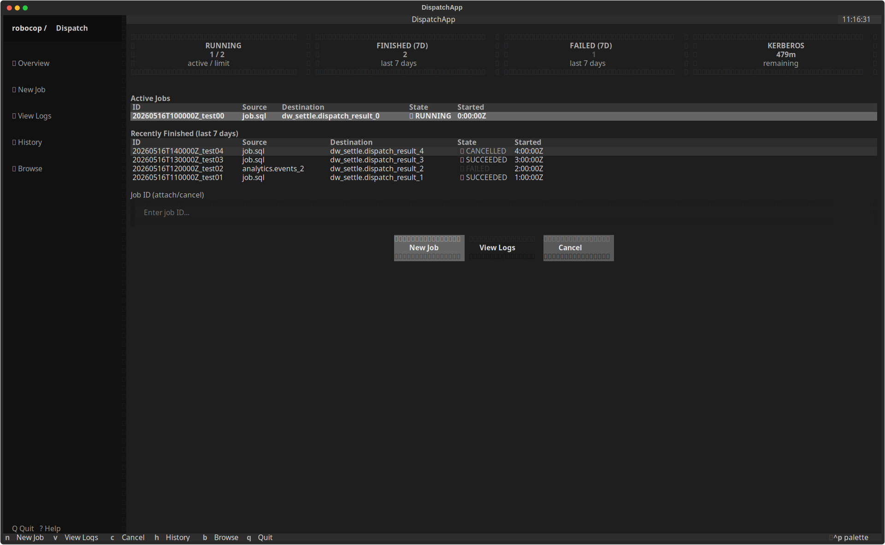
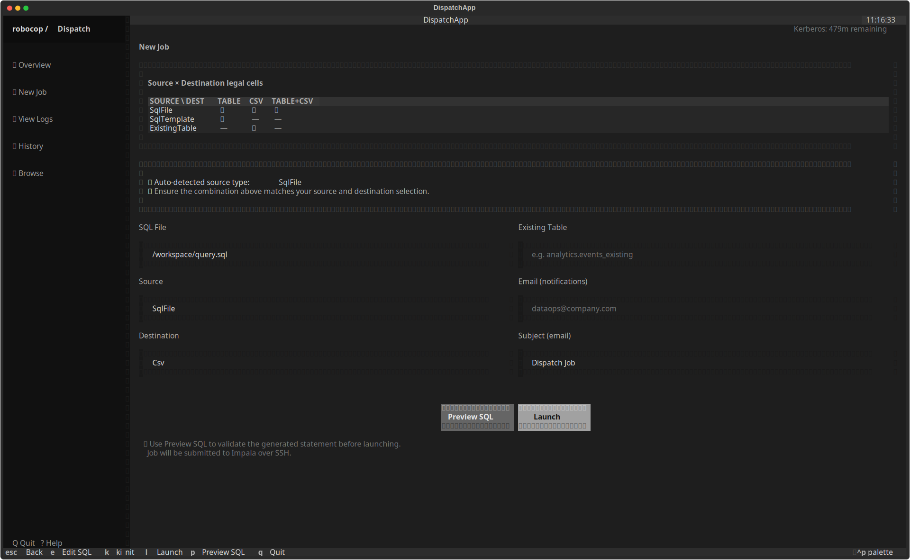
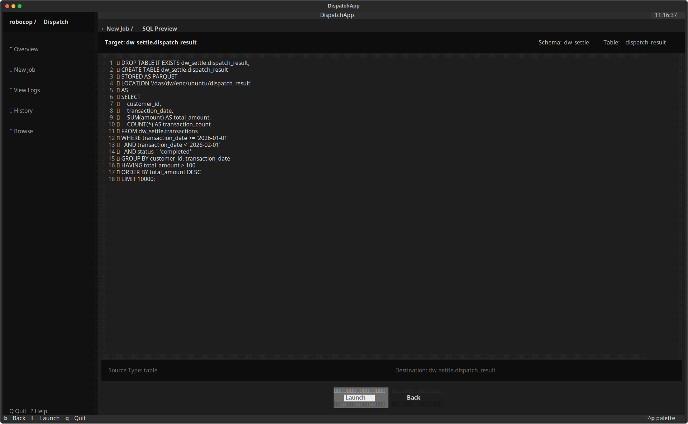
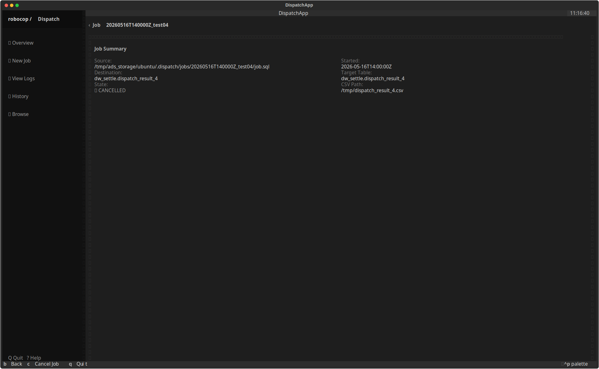
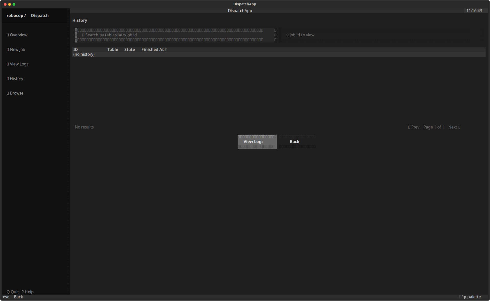
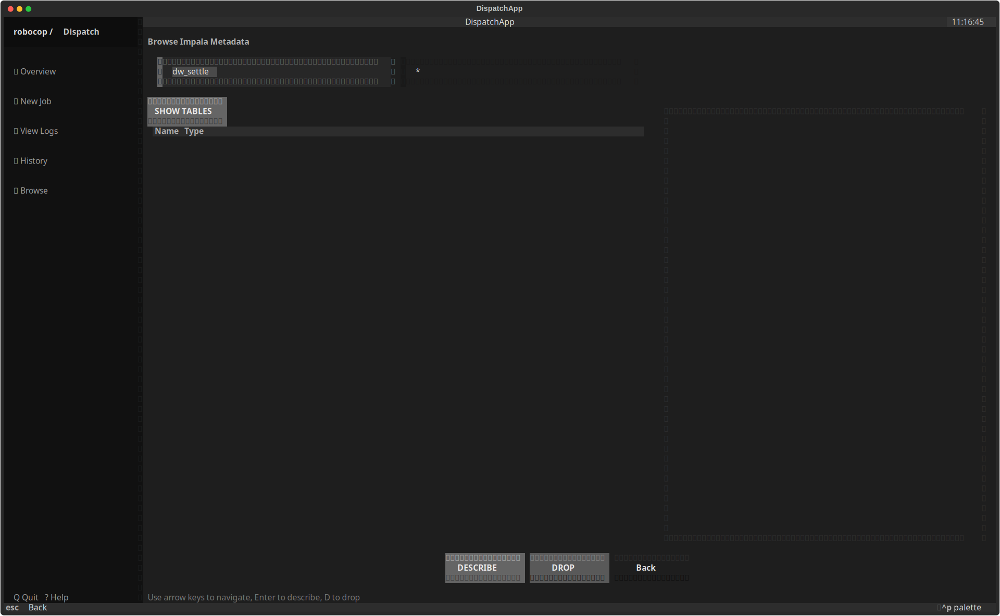
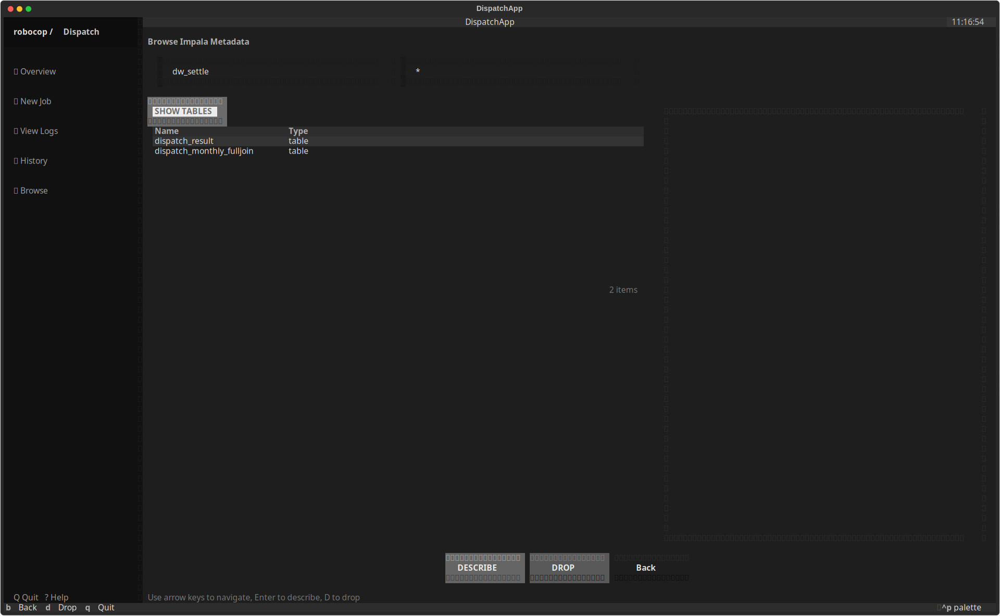

# Dispatch TUI — Screenshot-Driven UI/UX Review

**Date:** 2026-05-16
**Method:** Programmatic screenshot capture of every TUI screen via Textual's pilot API, followed by visual inspection and heuristic analysis.
**Terminal size:** 200×60
**Mock environment:** `happy_path` scenario with seeded Running / Succeeded / Failed / Cancelled jobs.

---

## Table of Contents

1. [Screen Inventory](#screen-inventory)
2. [Screen-by-Screen Analysis](#screen-by-screen-analysis)
   - [1. Dashboard (with jobs)](#1-dashboard-with-jobs)
   - [2. Dashboard (empty state)](#2-dashboard-empty-state)
   - [3. New Job](#3-new-job)
   - [4. SQL Preview](#4-sql-preview)
   - [5. Job Detail / View Logs](#5-job-detail--view-logs)
   - [6. History](#6-history)
   - [7. Browser (initial)](#7-browser-initial)
   - [8. Browser (tables loaded)](#8-browser-tables-loaded)
   - [9. Browser (with describe)](#9-browser-with-describe)
3. [Cross-Cutting UX Issues](#cross-cutting-ux-issues)
4. [Prioritized Improvement Plan](#prioritized-improvement-plan)
5. [Appendix: Screenshot Capture Method](#appendix-screenshot-capture-method)

---

## Screen Inventory

| # | Screen | File | States captured |
|---|--------|------|-----------------|
| 1 | Dashboard | `screens/dashboard.py` | With jobs (running + finished) |
| 2 | Dashboard | `screens/dashboard.py` | Empty state (no jobs) |
| 3 | New Job | `screens/new_job.py` | Default form |
| 4 | SQL Preview | `screens/preview.py` | With rendered SQL |
| 5 | Job Detail | `screens/job_detail.py` | Running job with logs |
| 6 | History | `screens/history.py` | With historical jobs |
| 7 | Browser | `screens/browser.py` | Initial (no tables loaded) |
| 8 | Browser | `screens/browser.py` | After SHOW TABLES |
| 9 | Browser | `screens/browser.py` | After DESCRIBE on selected table |

---

## Screen-by-Screen Analysis

### 1. Dashboard (with jobs)

**What works well:**
- Stats row (Running/Finished/Failed/Kerberos) gives immediate operational awareness at a glance.
- Color semantics are clear: green for running/success, red for failure, yellow for Kerberos TTL warnings.
- Keyboard shortcuts embedded in button labels (`New Job [N]`, `View Logs [V]`, `Cancel [C]`) aid discoverability.
- The sidebar navigation clearly marks the active section with a highlight.

**Issues found:**

| ID | Severity | Issue |
|----|----------|-------|
| D-1 | Medium | **Job IDs are truncated to 24 chars**, making similarly-prefixed IDs hard to distinguish in both Active and Recent tables. The ID format (`20260516T...`) means the first 15 characters are always identical for same-day jobs. |
| D-2 | High | **Job ID input for attach/cancel requires manual typing.** Users must copy/remember IDs from the table above and retype them. There is no click-to-select or cursor-row-to-fill interaction. |
| D-3 | Low | **The "active / limit" subtitle on the Running stat card is ambiguous** — "0 / 2" doesn't clearly communicate "running count / concurrency cap" to a new user. |
| D-4 | Medium | **Button row is horizontally centered** but the Job ID input section above it is left-aligned with different padding. Visual misalignment breaks the form flow. |
| D-5 | Low | **The `v` and `a` key bindings both map to `view_logs`**, but "Attach" vs "View Logs" suggests different semantics. This creates a confusing phantom distinction in the footer. |
| D-6 | Medium | **No visual indicator of table row selectability.** DataTable has `cursor_type="row"` but without a visible selected row highlight in the screenshot, users may not realize rows are interactive. |

**Proposals:**
1. **Click-to-fill:** When a row is selected/clicked in Active Jobs or Recent tables, auto-populate the Job ID input. Eliminates typing for the most common workflow.
2. **Show differentiating ID suffix:** Display only the unique portion (timestamp + token) or provide a tooltip/truncation that reveals the distinguishing part (e.g., `...T100000Z_test00`).
3. **Stat card subtitle:** Change "active / limit" to "running / cap" or better: show "0 running (max 2)".
4. **Unify `v`/`a` bindings:** Either remove the `a` binding or rename it to clarify distinct behavior (attach to live log stream vs. view static log).

---

### 2. Dashboard (empty state)

**Issues found:**

| ID | Severity | Issue |
|----|----------|-------|
| E-1 | High | **Empty state shows "(none)" with no guidance.** First-time users see a blank dashboard with no help on how to create their first job. There's no call-to-action or onboarding text. |
| E-2 | Medium | **Stats all show 0/-- which is technically correct but unhelpful.** Kerberos shows "--" which could mean unchecked, missing, or errored. |
| E-3 | Low | **The Recent table shows "(none)" in the ID column**, which pollutes the data model — it looks like an actual row rather than an empty-state indicator. |

**Proposals:**
1. **Rich empty state:** Replace `(none)` rows with a centered, styled empty-state block: "No jobs yet — press **N** to create your first job, or **H** to view history."
2. **Kerberos "--" semantic:** Change to "Not checked" or "Run kinit" with a yellow warning indicator to prompt action.
3. **Hide stat subtitles when zero:** When all counts are 0, show a condensed "No activity in the last 7 days" instead of four zero cards.

---

### 3. New Job

**What works well:**
- Source × Destination matrix is an excellent idea — shows valid combinations with checkmarks and em-dashes for illegal cells.
- Auto-detected source type banner provides proactive guidance.
- The 2-column grid layout is compact and shows many fields without scrolling.

**Issues found:**

| ID | Severity | Issue |
|----|----------|-------|
| NJ-1 | **Critical** | **Source and Destination are free-text inputs**, allowing arbitrary typos (`"csv"`, `"TABLE"`, `"talbe"`) that only fail at validation time. The matrix shows the legal values but the form doesn't enforce them. |
| NJ-2 | High | **Form tab order in the 2-column grid is confusing.** The grid is `grid-size: 2 6` which means labels and inputs interleave across columns. Tab traversal goes: SQL File label → Existing Table label → SQL File input → Existing Table input (across rows), which is disorienting. |
| NJ-3 | Medium | **Hardcoded date defaults** (`2026-01-01` / `2026-01-31`) become stale. By May 2026, these defaults are 4 months old and almost certainly wrong for any new job. |
| NJ-4 | Medium | **The info panel warning text ("Ensure the combination above matches...") is vague.** It doesn't specify what action to take or what the consequence of a mismatch is. |
| NJ-5 | Low | **Email field is empty with no validation hint.** No indication of required format, whether it's optional, or what happens if left blank. |
| NJ-6 | Medium | **Matrix panel takes ~8 lines of vertical space** to show a 3×4 table that is static reference information. It competes for screen real estate with the form itself. |
| NJ-7 | Low | **The "Schema" default (`aa_enc`) is hardcoded** and may not apply to all users. Should be read from config or last-used value. |

**Proposals:**
1. **Replace Source/Destination with `Select` widgets** (Textual dropdowns). Constrain choices to `SqlFile | SqlTemplate | ExistingTable` and `Table | Csv | Table+Csv`. Disable illegal combinations dynamically when one is selected.
2. **Fix form grid layout:** Switch from a label row + input row pattern to a vertical field group pattern (`label → input` stacked within each column) so that tab order follows visual reading order.
3. **Dynamic date defaults:** Default to current month's first and last day (`date.today().replace(day=1)` and end-of-month).
4. **Collapsible matrix panel:** Make the Source × Destination matrix collapsible or move it to a help/tooltip that opens on `?`. Reclaim vertical space for the form.
5. **Inline field validation:** Show a small `✓` or `✗` next to each field as the user types, rather than waiting for the Launch button.
6. **Persist last-used values:** Store the last successful job's schema, email, and destination in config, and pre-fill them.

---

### 4. SQL Preview

**What works well:**
- Clean, focused layout with a single purpose.
- Line-numbered SQL display is an excellent touch for readability and debugging.
- Breadcrumb navigation ("‹ New Job / SQL Preview") maintains context.
- Metadata bar shows target table and schema clearly.

**Issues found:**

| ID | Severity | Issue |
|----|----------|-------|
| SP-1 | High | **The Launch button on this screen only calls `pop_screen()`** — it does NOT actually submit the job. This is misleading: the user sees "Launch [L]" and expects it to run the job. It silently pops back to New Job without feedback. |
| SP-2 | Medium | **No syntax highlighting** in the SQL display. The SQL is shown as plain monochrome text with line numbers. Even basic keyword highlighting (SELECT, FROM, WHERE in a distinct color) would significantly improve readability. |
| SP-3 | Low | **"Source Type: table" in the footer is hardcoded** and doesn't reflect the actual source type detected from the form. |
| SP-4 | Low | **The Back button label says "Back [Esc]"** but the binding is actually `b` OR Escape. The label could say "Back [B/Esc]" for accuracy. |

**Proposals:**
1. **Fix the Launch action:** Either wire the Launch button to actually submit the job (calling back into `NewJobScreen.action_launch`), or rename it to "Confirm & Return" or "Accept" to clarify the semantics.
2. **Add SQL syntax highlighting:** Use Textual's `Syntax` widget or Rich's syntax highlighting to colorize SQL keywords, strings, and numbers.
3. **Dynamic footer metadata:** Pull source type and destination from the originating form data rather than hardcoding.

---

### 5. Job Detail / View Logs

**What works well:**
- Two-column summary panel efficiently displays job metadata.
- Live log streaming indicator ("Streaming logs… (auto-scroll) ●") clearly communicates real-time state.
- RichLog widget with auto-scroll provides a natural log-tail experience.
- Color-coded state labels (green RUNNING, red FAILED, dim CANCELLED) are instantly legible.

**Issues found:**

| ID | Severity | Issue |
|----|----------|-------|
| JD-1 | **Critical** | **Cancel Job has no confirmation dialog.** Pressing `C` or clicking "Cancel Job" immediately sends SIGTERM to the process group. For a long-running Impala query, accidental cancellation can waste hours of compute. |
| JD-2 | Medium | **No elapsed time or ETA display.** The summary shows "Started" timestamp but no wall-clock elapsed time. For jobs running minutes to hours, knowing "running for 47m" is more useful than the raw timestamp. |
| JD-3 | Medium | **Log panel shows raw text without timestamp highlighting.** Log lines include `[2026-05-16 10:00:00]` timestamps but they're not visually differentiated from the log body. |
| JD-4 | Low | **Summary shows "--" for CSV Path even when destination type is Table** (no CSV). Should show "N/A" or hide the field entirely when not applicable. |
| JD-5 | Low | **The "Back [B]" button and "Cancel Job [C]" button are placed adjacently** with no visual separator. Muscle-memory mis-clicks between "go back" and "kill this job" are dangerous. |

**Proposals:**
1. **Add a confirmation modal before cancel:** Show a Textual `Screen`-based modal: "Cancel job {id}? This will send SIGTERM to PID {pid}. [Y]es / [N]o". Require explicit confirmation.
2. **Show elapsed time:** Add a live-updating "Elapsed: 2m 34s" field to the summary grid, calculated from `started_at`.
3. **Log timestamp highlighting:** Apply `[dim]` styling to timestamp prefixes in log lines for visual separation.
4. **Conditional field display:** Hide "CSV Path" when destination type doesn't include CSV. Show "N/A — Table-only destination" when not applicable.
5. **Button separation:** Add visual spacing or a divider between the Cancel and Back buttons to reduce accidental clicks.

---

### 6. History

**What works well:**
- Search input with magnifying glass icon is immediately recognizable.
- Separate Job ID input for quick access to specific logs.
- Pagination info text ("Showing 1-3 of 3") is clear.

**Issues found:**

| ID | Severity | Issue |
|----|----------|-------|
| H-1 | High | **Pagination controls are non-functional text.** The "❮ Prev / Next ❯" is rendered as a Static label — there are no actual keybindings or click handlers for page navigation. Users with >17 jobs cannot navigate pages. |
| H-2 | High | **Viewing logs requires manual ID entry.** Like the dashboard, there's no way to select a row and press Enter to view its logs. The `enter` binding exists (`action_view_logs`) but it reads from the `#job-id` Input, not from the table row selection. |
| H-3 | Medium | **Search is case-sensitive substring matching only.** There's no fuzzy matching, date range filtering, or state filtering (e.g., "show only failed jobs"). |
| H-4 | Medium | **Job IDs are truncated to 24 chars in the table** (same as dashboard). Combined with the narrow 25-char table name truncation, important data is lost. |
| H-5 | Low | **No column sorting.** The table is pre-sorted by finished_at descending but users cannot re-sort by state, table name, or ID. |

**Proposals:**
1. **Implement pagination keybindings:** Add `[` / `]` or `<` / `>` keys for Prev/Next page. Wire them to `self._page ± 1` and `refresh_history()`.
2. **Wire table row selection to View Logs:** When a row is highlighted and Enter is pressed, extract the job ID from the row data (not the separate input) and navigate to JobDetailScreen.
3. **Add state filter:** Add a third Input or a Select widget for filtering by state: All / Running / Succeeded / Failed / Cancelled.
4. **Widen ID column or show full ID on row focus:** Display the full job ID in a status line at the bottom when a row is highlighted.

---

### 7. Browser (initial)

**What works well:**
- Split-panel layout (table list + detail pane) follows a familiar master-detail pattern.
- Schema and filter inputs with sensible defaults (`aa_enc`, `*`).
- Help text at the bottom explains keyboard navigation.

**Issues found:**

| ID | Severity | Issue |
|----|----------|-------|
| B-1 | Medium | **The right panel is completely blank on initial load.** Users see an empty void with no guidance on what to do. Should show a placeholder message. |
| B-2 | Medium | **The SHOW TABLES button is positioned between the filter inputs and the results table** but visually doesn't look like a primary action — it's just a button with no emphasis in the layout flow. |
| B-3 | Low | **The table only shows two columns (Name, Type)** where Type is always "table". The column adds no information and wastes horizontal space. |

**Proposals:**
1. **Add right-panel placeholder:** Show "Select a table and press Enter to view its schema" in the detail pane when nothing is selected.
2. **Auto-load on mount:** Trigger SHOW TABLES automatically when the Browser screen mounts, so users immediately see content.
3. **Remove or enhance Type column:** Either remove the static "table" column, or show additional metadata (row count estimate, partition info) when available.

---

### 8. Browser (tables loaded)

**Issues found:**

| ID | Severity | Issue |
|----|----------|-------|
| BT-1 | Low | **Status bar shows "2 items" but the right pane is still empty.** After loading tables, the user still needs a second action (Enter or click Describe) to see details. |
| BT-2 | Low | **The filter input shows `*` as default wildcard** which works but is non-obvious. A placeholder like "Filter tables (e.g., dispatch_*)" would be clearer. |

**Proposals:**
1. **Auto-describe first table:** When tables load, automatically select and describe the first row to fill the detail pane immediately.
2. **Improve filter placeholder:** Use a more descriptive placeholder that shows example patterns.

---

### 9. Browser (with describe)

**What works well:**
- Detail pane fills with schema information in a clear line-numbered format.
- Selected table name is highlighted in both the status bar and detail header.
- Clean separation between metadata info and column definitions.

**Issues found:**

| ID | Severity | Issue |
|----|----------|-------|
| BD-1 | **Critical** | **DROP TABLE has no confirmation.** Pressing `D` immediately executes `DROP TABLE IF EXISTS` on the selected table. This is a destructive, irreversible operation with zero safety net. |
| BD-2 | Medium | **Describe output uses pipe-delimited format** (`name|type|comment`) which is hard to read. Should be rendered as a formatted table or at minimum with column alignment. |
| BD-3 | Low | **The detail pane title duplicates information** — both `#file-preview-title` and `#file-preview-path` show essentially the same `schema.table` string. |

**Proposals:**
1. **Add a confirmation modal for DROP:** This is the single most important safety improvement in the entire TUI. Show: "DROP TABLE `aa_enc.dispatch_result`? This action is IRREVERSIBLE. Type the table name to confirm: ___"
2. **Format describe output as a DataTable:** Parse the pipe-delimited output and render it as a proper Textual DataTable with Name, Type, and Comment columns.
3. **Deduplicate detail header:** Show the full qualified name once in the title, and use the subtitle for additional metadata (e.g., "Impala Table · 3 columns").

---

## Cross-Cutting UX Issues

### A. Navigation Inconsistency

| Screen | Back key | Back button | Escape behavior |
|--------|----------|-------------|-----------------|
| Dashboard | — | — | (root screen) |
| New Job | Escape | — | pops screen |
| Preview | `b` or Escape | "Back [Esc]" | pops screen |
| Job Detail | `b` or Escape | "Back [B]" | pops screen |
| History | `b` or Escape | "Back [B]" | pops screen |
| Browser | `b` or Escape | "Back [B]" | pops screen |

**Issue:** Escape works everywhere for back navigation, but `b` is only bound on non-root screens. New Job uses Escape but doesn't bind `b`. This inconsistency means the user must remember different back shortcuts per screen.

**Proposal:** Standardize: Escape and `b` both navigate back on ALL non-root screens. Add `("b", "app.pop_screen", "Back")` to `NewJobScreen.BINDINGS`.

### B. No Confirmation Modals Anywhere

The entire application has zero confirmation dialogs. Destructive actions (Cancel Job, Drop Table, Launch Job) execute immediately. Textual supports modal screens via `push_screen` with a callback — this pattern should be used for:
- Cancel Job (SIGTERM to running process)
- Drop Table (irreversible DDL)
- Launch Job (kicks off potentially long-running work on production cluster)

### C. Sidebar Help Text Promises Undelivered Feature

The sidebar footer shows `Q Quit   ? Help` but there is no `?` binding defined on `DispatchApp` or any screen. Pressing `?` does nothing. Either implement a help screen or remove the `? Help` text.

### D. No Toast/Notification System

Success and error messages are shown inline in `#warning-text` Static widgets that are easy to miss — especially if the user isn't looking at the right part of the screen. Textual provides `self.notify()` for toast-style notifications that appear in an overlay. This should be used for:
- Job launch success/failure
- Kerberos renewal
- Table drop confirmation
- Validation errors

### E. Footer Binding Clutter

The Footer shows ALL bindings for the current screen. On the Dashboard, this includes: `New Job  View Logs  Attach  Cancel  History  Browse  Quit` — 7 bindings in a single row. This is a lot of visual noise. Consider grouping bindings by function or hiding less-common bindings behind a `?` help screen.

### F. No Keyboard Shortcut Reference

Beyond the footer hints, there's no comprehensive shortcut reference. A `?` key binding that opens a help screen listing all shortcuts organized by screen would significantly aid discovery for new users.

---

## Prioritized Improvement Plan

### P0 — Safety-Critical (must fix)

| # | Issue | Screen | Effort |
|---|-------|--------|--------|
| 1 | Add confirmation modal for DROP TABLE | Browser | Small — one new modal Screen class |
| 2 | Add confirmation modal for Cancel Job | Job Detail | Small — reuse modal pattern from #1 |
| 3 | Fix Preview "Launch" button semantics | Preview | Tiny — rename button or wire actual launch |

### P1 — High-Impact UX (should fix)

| # | Issue | Screen | Effort |
|---|-------|--------|--------|
| 4 | Replace Source/Destination text inputs with Select widgets | New Job | Medium — requires Textual Select + event wiring |
| 5 | Wire table row selection → auto-fill Job ID | Dashboard | Small — on `DataTable.RowSelected`, fill Input |
| 6 | Wire history table row selection → View Logs | History | Small — same pattern as #5 |
| 7 | Implement pagination keybindings | History | Small — add `[`/`]` bindings |
| 8 | Rich empty-state messaging | Dashboard | Small — replace `(none)` rows with styled Static |
| 9 | Standardize back navigation (`b` + Escape everywhere) | All screens | Tiny — add missing binding to New Job |
| 10 | Implement `?` help screen or remove the hint | Global | Medium — create HelpScreen or remove text |

### P2 — Polish & Enhancement

| # | Issue | Screen | Effort |
|---|-------|--------|--------|
| 11 | Dynamic date defaults (current month) | New Job | Tiny |
| 12 | SQL syntax highlighting in Preview | Preview | Medium — integrate Rich Syntax |
| 13 | Elapsed time display for running jobs | Job Detail | Small — timer + delta calc |
| 14 | Toast notifications via `self.notify()` | Global | Medium — replace inline warnings |
| 15 | Format DESCRIBE output as DataTable | Browser | Small — parse + render |
| 16 | Auto-load tables on Browser mount | Browser | Tiny — call action_show_tables in on_mount |
| 17 | Collapsible Source × Dest matrix | New Job | Medium — Textual Collapsible widget |
| 18 | Fix form tab order (vertical field groups) | New Job | Medium — restructure grid layout |
| 19 | Persist last-used form values | New Job | Small — read/write config.json |
| 20 | Right-panel placeholder text in Browser | Browser | Tiny |

### P3 — Future Considerations

| # | Issue | Effort |
|---|-------|--------|
| 21 | Minimum terminal size detection + warning | Small |
| 22 | Color theme validation (light/high-contrast terminals) | Medium |
| 23 | Column sorting in History table | Medium |
| 24 | Fuzzy search / state filter in History | Medium |
| 25 | Job duration estimation / progress bar for long queries | Large |

---

## Appendix: Screenshot Capture Method

Screenshots were captured programmatically using Textual's `run_test()` pilot API at 200×60 terminal size with the `happy_path` mock scenario. The capture script:

1. Seeds 5 test jobs (Running, Succeeded, Failed, Succeeded, Cancelled) with realistic manifest data and log files.
2. Creates a sample `query.sql` file for the New Job and Preview screens.
3. Navigates to each screen using keyboard shortcuts (`n`, `p`, `v`, `h`, `b`) and button clicks.
4. Calls `app.save_screenshot()` to produce SVG output.
5. Converts SVGs to PNGs via CairoSVG at 1920px width.

All 9 screenshots are stored in `docs/screenshots/` alongside this report.
