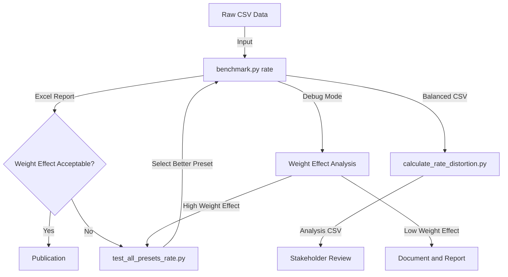
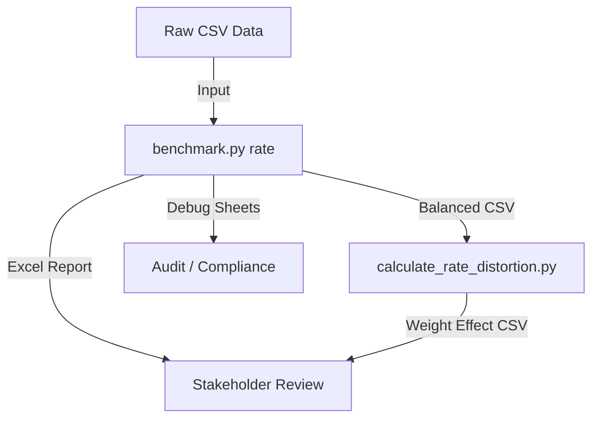

# Rate Analysis Workflow Documentation

## Overview

This document provides comprehensive documentation for the rate analysis workflow that complements the Peer Benchmark Tool's core functionality. It focuses on approval and fraud rate benchmarking, how privacy-constrained weighting affects rates, and how to produce stakeholder-ready outputs. It mirrors the structure of SHARE_ANALYSIS_WORKFLOW.md while documenting the current rate analysis implementation and recommended supporting scripts.

## Quick Reference

| Scenario | Command | Output |
|----------|---------|--------|
| Approval rate benchmark | `py benchmark.py rate --total-col txn_cnt --approved-col appr_cnt` | Excel with approval rates by dimension |
| Fraud rate benchmark | `py benchmark.py rate --total-col txn_cnt --fraud-col fraud_cnt` | Excel with fraud rates by dimension |
| Multi-rate analysis | `py benchmark.py rate --total-col txn_cnt --approved-col appr_cnt --fraud-col fraud_cnt` | Excel with approval + fraud in the same sheet |
| With weight effect details | Add `--debug` to any command | Adds Original Peer Average and Weight Effect (pp) |
| Export weighted totals | Add `--export-balanced-csv` | Creates CSV with weighted totals |

## Table of Contents

1. [Workflow Architecture](#workflow-architecture)
2. [Script Catalog](#script-catalog)
3. [Workflow Patterns](#workflow-patterns)
4. [Usage Examples](#usage-examples)
5. [Data Schema Requirements](#data-schema-requirements)
6. [Data Flow](#data-flow)
7. [Interpreting Weight Effect](#interpreting-weight-effect)
8. [Multi-Rate Best Practices](#multi-rate-best-practices)
9. [Extension Points](#extension-points)
10. [Best Practices](#best-practices)
11. [Troubleshooting Guide](#troubleshooting-guide)
12. [File Naming Conventions](#file-naming-conventions)
13. [Version Control Guidance](#version-control-guidance)
14. [Future Enhancement Roadmap](#future-enhancement-roadmap)
15. [Appendix](#appendix)

---

## Workflow Architecture

### Core Concept

Rate analysis answers questions like:

- Approval Rate = Approved / Total
- Fraud Rate = Fraud / Total

Unlike share analysis (which rebalances volumes and changes market share), rate analysis compares ratios. The privacy algorithm still applies weights to peers, but those weights are computed from the denominator (total_col) and then applied to both numerators and denominators. This can move the peer benchmark rate even when the target's raw rate is unchanged.

All rate outputs are expressed as percentages by default. If stakeholders expect fraud in basis points (bps), multiply percent by 100 as a presentation-layer conversion.

### Weight Effect (Rate "Distortion")

For rates, the primary change introduced by privacy weighting is the shift in the peer benchmark rate. This is reported as Weight Effect (pp):

- Original Peer Average (%) = sum(peer_numerator) / sum(peer_denominator) * 100
- Balanced Peer Average (%) = sum(peer_numerator * weight) / sum(peer_denominator * weight) * 100
- Weight Effect (pp) = Balanced Peer Average - Original Peer Average

This Weight Effect is computed by the core tool in debug mode and should be the primary metric for describing privacy impact in rate analysis.

### Rate vs Share Distortion: Key Differences

| Aspect | Share Analysis | Rate Analysis |
|--------|----------------|---------------|
| What changes | Entity market share | Peer benchmark rate |
| Target entity | Excluded from balancing | Excluded from balancing |
| Distortion mechanism | Peer volume inflation changes denominator | Weights applied to both numerator and denominator |
| Distortion formula | (Entity/(Entity+Balanced Peers)) - (Entity/(Entity+Raw Peers)) | (Weighted Num/Weighted Den) - (Raw Num/Raw Den) |
| Typical impact | Often negative (share decreases) | Can be positive or negative depending on peer distribution |
| Zero-distortion case | Peer-only mode with uniform scaling | Not guaranteed because rates are weighted averages |

See also: [SHARE_ANALYSIS_WORKFLOW.md](SHARE_ANALYSIS_WORKFLOW.md) for the share distortion formula and patterns.

### Approval vs Fraud

Approval rate uses the default best-in-class percentile (typically 85th; higher is better). Fraud rate is "lower is better" and uses an inverted percentile in the core calculation when the numerator column name starts with "fraud". In multi-rate mode, weights are shared across approval and fraud calculations (based on total_col).

### Core Implementation Validation (Where This Is Implemented)

The following core implementation details validate the workflow:

1. Weight calculation is based on total_col only
   - See `core/dimensional_analyzer.py` -> `calculate_global_privacy_weights`
   - The same weights are used for all rate types

2. Rate calculation uses weighted numerator and denominator
   - See `core/dimensional_analyzer.py` -> `_calculate_rate_metrics`
   - Balanced Peer Average (%) is calculated as weighted average rate

3. Fraud BIC percentile inversion
   - See `core/dimensional_analyzer.py` -> `_calculate_rate_metrics`
   - Fraud uses `(1 - bic_percentile)` when numerator name starts with "fraud"

4. Multi-rate reporting uses shared weights
   - See `benchmark.py` -> `generate_multi_rate_excel_report`
   - Approval and fraud columns are combined in the same dimension sheet

### Three-Phase Architecture (Rate)



Phase 1: Configuration Testing - Determine presets that minimize weight effect  
Phase 2: Rate Analysis - Compute approval/fraud rates and privacy impacts  
Phase 3: Reporting - Publish rate benchmarks and weight effect summaries

---
## Script Catalog

### 1. benchmark.py (rate command)

**Purpose**: Core rate analysis engine for approval and fraud rates

**Category**: Core analysis

**Key Features**:
- Computes approval and/or fraud rates across dimensions
- Supports multi-rate analysis (approval + fraud together)
- Uses privacy weights derived from total_col (shared across rate types)
- Supports time-aware analysis via --time-col
- Optional secondary metrics output using the same weights
- Optional export of balanced totals via --export-balanced-csv

**Primary Use Case**: Produce privacy-compliant approval and fraud rate benchmarks

**Workflow Position**: Core analysis step for every rate workflow

**Input Requirements**:
```text
--csv           Path to CSV input file (long format)
--total-col     Denominator column (required)
--approved-col  Approval numerator column (optional)
--fraud-col     Fraud numerator column (optional)
--entity        Target entity (optional; omit for peer-only)
--dimensions    Dimension columns (optional if --auto)
--time-col      Time column (optional)
--preset        Preset name (optional)
```

**Output Artifacts**:
1. Excel report:
   - Single-rate: `benchmark_{approval|fraud}_rate_*.xlsx`
   - Multi-rate: `benchmark_multi_rate_*.xlsx`
2. Optional balanced CSV: `benchmark_*_balanced.csv`
3. Optional debug sheets (Peer Weights, Privacy Validation, Weight Methods)

**Rate Output Columns (dimension sheets)**:
```text
Category
[Time column, if enabled]
Balanced Peer Average (%)
BIC (%)
Target Rate (%)                  (only if --entity)
Distance to Peer (pp)            (only if --entity)

Debug mode adds:
Original Peer Average (%)
Original Total Numerator
Original Total Denominator
Weight Effect (pp)
```

**Multi-rate Output Columns** (combined sheet):
```text
Category,
Approval_Balanced Peer Average (%),
Approval_BIC (%),
Approval_Target Rate (%),
Approval_Distance to Peer (pp),
Fraud_Balanced Peer Average (%),
Fraud_BIC (%),
Fraud_Target Rate (%),
Fraud_Distance to Peer (pp),
... (debug columns prefixed Approval_ / Fraud_)
```

**Balanced CSV (rate)**:
When --export-balanced-csv is enabled, a CSV is generated with weighted totals. Column names use the original input columns:
```csv
Dimension,Category,[Time],total_col,approved_col,fraud_col,secondary_metrics...
```
These are weighted peer totals, not rates. Rates can be recomputed as approved/total or fraud/total.

**Typical Use**:
```bash
py benchmark.py rate \
  --csv data/sample.csv \
  --entity "ENTITY NAME" \
  --total-col txn_cnt \
  --approved-col appr_cnt \
  --fraud-col fraud_cnt \
  --dimensions flag_domestic card_type \
  --time-col year_month \
  --preset balanced_default \
  --export-balanced-csv \
  --debug
```

---

### 2. Existing Deliverables (manual outputs)

**Purpose**: Past manual or ad-hoc rate outputs that should be automated

**Location**: `deliveries/`

**Known Files**:
- `deliveries/fortbrasil_auth_fraud_rates.csv`
- `deliveries/fortbrasil_auth_fraud_rates_v2.csv`
- `deliveries/fortbrasil_auth_fraud_rates_v3.csv`

**Observed Schema Patterns**:
- `Dimension, Category, Balanced_Peer_Average_%` (v1)
- `Dimension, Category, amt_total, amt_approved, amt_fraud, ...` (v2/v3)

**Example snippet (v3)**:
```csv
Dimension,Category,amt_local_currency,amt_approved,amt_fraud,qtde_txns_ttl,qtde_txns_fraud,qtde_txns_app,qtde_declined
pan_entry_mode_recurring,CHIP / 0,37311109541,31371009069,5947025.41,172946176.1,10075.39,159836170.4,13110005.66
pan_entry_mode_recurring,CREDENTIAL ON FILE / 0,15580134979,9075853211,48631300.25,162720403.1,320157.53,121487907.7,41232495.41
```

These files appear to be manual exports or curated rate summaries. They should be automated using the recommended scripts below.

---

### 3. Recommended Additions (Rate Workflow Scripts)

The following scripts do not exist yet but are recommended additions to complete the rate analysis workflow (analogous to share analysis scripts). Each section includes implementation guidance so a developer can build the script without reverse-engineering.

#### 3.1 test_all_presets_rate.py (recommended)

**Purpose**: Compare presets by weight effect and target distance impact

**Key Features**:
- Runs `benchmark.py rate` across presets (with/without --per-dimension-weights)
- Extracts Weight Effect (pp) by category and time
- Summarizes mean/min/max weight effect per dimension and rate type

**Inputs**:
```text
--csv, --entity (optional), --total-col, --approved-col (optional), --fraud-col (optional),
--dimensions, --time-col (optional)
```

**Outputs**:
- `rate_preset_comparison_results.csv`
- Optional pivot tables in console output

**Implementation Sketch**:
```python
# test_all_presets_rate.py
import argparse
import subprocess
import pandas as pd
from pathlib import Path

PRESETS = [
    {"name": "compliance_strict", "preset": "compliance_strict", "flags": []},
    {"name": "balanced_default", "preset": "balanced_default", "flags": []},
    {"name": "research_exploratory", "preset": "research_exploratory", "flags": []},
    {"name": "low_distortion", "preset": "low_distortion", "flags": []},
    {"name": "minimal_distortion", "preset": "minimal_distortion", "flags": []},
    {"name": "balanced_default+perdim", "preset": "balanced_default", "flags": ["--per-dimension-weights"]},
]


def run_benchmark_rate(args, preset_config):
    cmd = [
        "py", "benchmark.py", "rate",
        "--csv", args.csv,
        "--total-col", args.total_col,
        "--dimensions", *args.dimensions,
        "--preset", preset_config["preset"],
        "--debug",
        "--export-balanced-csv",
    ]
    if args.entity:
        cmd += ["--entity", args.entity]
    if args.approved_col:
        cmd += ["--approved-col", args.approved_col]
    if args.fraud_col:
        cmd += ["--fraud-col", args.fraud_col]
    if args.time_col:
        cmd += ["--time-col", args.time_col]
    cmd += preset_config["flags"]
    subprocess.run(cmd, check=True)


def extract_weight_effect_from_excel(xlsx_path, rate_type):
    # Read dimension sheets and pull Weight Effect (pp) columns
    import pandas as pd
    xls = pd.ExcelFile(xlsx_path)
    results = []
    for sheet in xls.sheet_names:
        if sheet in ["Summary", "Peer Weights", "Privacy Validation", "Weight Methods", "Secondary Metrics"]:
            continue
        df = pd.read_excel(xlsx_path, sheet_name=sheet)
        for col in df.columns:
            if "Weight Effect" in col:
                df_sub = df[["Category", col]].copy()
                df_sub["Dimension"] = sheet
                df_sub["Rate_Type"] = rate_type
                df_sub.rename(columns={col: "Weight_Effect_pp"}, inplace=True)
                results.append(df_sub)
    return pd.concat(results, ignore_index=True) if results else pd.DataFrame()


# Summarize mean/min/max by category
# Save comparison CSV
```

#### 3.2 calculate_rate_distortion.py (recommended)

**Purpose**: Compute weight effect from raw + balanced CSV outputs

**Key Features**:
- Calculates raw peer rate
- Calculates balanced peer rate from weighted totals
- Computes Weight Effect (pp)
- Adds target rate and distance to peer if entity is provided

**Inputs**:
```text
--raw, --balanced, --total-col, --approved-col (optional), --fraud-col (optional),
--entity (optional), --entity-col (optional), --time-col (optional)
```

**Outputs**:
- `rate_distortion_analysis.csv`

**Implementation Example**:
```python
import pandas as pd


def calculate_rate_distortion(raw_df, balanced_df,
                              total_col, approved_col=None, fraud_col=None,
                              entity=None, entity_col="issuer_name", time_col=None):
    results = []

    dims = balanced_df["Dimension"].unique()
    for dim in dims:
        bal_dim = balanced_df[balanced_df["Dimension"] == dim]
        categories = bal_dim["Category"].unique()

        for cat in categories:
            bal_cat = bal_dim[bal_dim["Category"] == cat]
            time_periods = bal_cat[time_col].unique() if time_col and time_col in bal_cat.columns else [None]

            for t in time_periods:
                if t is None:
                    raw_cat = raw_df[raw_df[dim] == cat]
                    bal_row = bal_cat.iloc[0]
                else:
                    raw_cat = raw_df[(raw_df[dim] == cat) & (raw_df[time_col] == t)]
                    bal_row = bal_cat[bal_cat[time_col] == t].iloc[0]

                # Raw peer totals (exclude entity if provided)
                if entity:
                    raw_peers = raw_cat[raw_cat[entity_col] != entity]
                    raw_target = raw_cat[raw_cat[entity_col] == entity]
                else:
                    raw_peers = raw_cat
                    raw_target = None

                raw_total = raw_peers[total_col].sum()

                row = {
                    "Dimension": dim,
                    "Category": cat,
                }
                if t is not None:
                    row[time_col] = t

                # Approval rate
                if approved_col:
                    raw_approved = raw_peers[approved_col].sum()
                    raw_rate = (raw_approved / raw_total * 100) if raw_total > 0 else 0.0
                    bal_rate = (bal_row[approved_col] / bal_row[total_col] * 100) if bal_row[total_col] > 0 else 0.0
                    row["Raw_Approval_Rate_%"] = round(raw_rate, 4)
                    row["Balanced_Approval_Rate_%"] = round(bal_rate, 4)
                    row["Approval_Weight_Effect_pp"] = round(bal_rate - raw_rate, 4)

                    if raw_target is not None:
                        targ_rate = (raw_target[approved_col].sum() / raw_target[total_col].sum() * 100) if raw_target[total_col].sum() > 0 else 0.0
                        row["Target_Approval_Rate_%"] = round(targ_rate, 4)
                        row["Approval_Distance_to_Peer_pp"] = round(targ_rate - bal_rate, 4)

                # Fraud rate
                if fraud_col:
                    raw_fraud = raw_peers[fraud_col].sum()
                    raw_rate = (raw_fraud / raw_total * 100) if raw_total > 0 else 0.0
                    bal_rate = (bal_row[fraud_col] / bal_row[total_col] * 100) if bal_row[total_col] > 0 else 0.0
                    row["Raw_Fraud_Rate_%"] = round(raw_rate, 4)
                    row["Balanced_Fraud_Rate_%"] = round(bal_rate, 4)
                    row["Fraud_Weight_Effect_pp"] = round(bal_rate - raw_rate, 4)

                    if raw_target is not None:
                        targ_rate = (raw_target[fraud_col].sum() / raw_target[total_col].sum() * 100) if raw_target[total_col].sum() > 0 else 0.0
                        row["Target_Fraud_Rate_%"] = round(targ_rate, 4)
                        row["Fraud_Distance_to_Peer_pp"] = round(targ_rate - bal_rate, 4)

                results.append(row)

    return pd.DataFrame(results)
```
#### 3.3 analyze_rate_distortion.py (recommended)

**Purpose**: Aggregated pivot tables for weight effect

**Key Features**:
- Pivots by dimension/category/time
- Summary statistics by rate type
- Identifies top-variance categories

**Outputs**:
- `rate_distortion_summary.csv`

**Implementation Example**:
```python
import pandas as pd


def summarize_rate_distortion(df, rate_prefix):
    cols = [c for c in df.columns if c.startswith(rate_prefix) and c.endswith("Weight_Effect_pp")]
    if not cols:
        return pd.DataFrame()
    col = cols[0]
    summary = df.groupby(["Dimension", "Category"])[col].agg(["mean", "min", "max"]).reset_index()
    summary.rename(columns={"mean": "Mean", "min": "Min", "max": "Max"}, inplace=True)
    return summary


# Example usage:
# df = pd.read_csv("rate_distortion_analysis.csv")
# approval_summary = summarize_rate_distortion(df, "Approval_")
# fraud_summary = summarize_rate_distortion(df, "Fraud_")
```

#### 3.4 generate_rate_report.py (recommended)

**Purpose**: Publication-ready Excel report for rate benchmarks

**Key Features**:
- Tables of approval and fraud rates side by side
- Optional bps conversion for fraud rate
- Supports multi-year or monthly views

**Implementation Example**:
```python
import pandas as pd
from openpyxl import Workbook
from openpyxl.styles import Font, PatternFill


def write_rate_table(ws, df, title, start_row=1):
    ws.cell(row=start_row, column=1, value=title).font = Font(bold=True, size=12)
    for c_idx, col in enumerate(df.columns, start=1):
        cell = ws.cell(row=start_row + 2, column=c_idx, value=col)
        cell.font = Font(bold=True)
        cell.fill = PatternFill(start_color="DDDDDD", end_color="DDDDDD", fill_type="solid")
    for r_idx, row in enumerate(df.values, start=start_row + 3):
        for c_idx, val in enumerate(row, start=1):
            ws.cell(row=r_idx, column=c_idx, value=val)


# Build pivot tables from rate output and write to Excel
```

#### 3.5 rate_quality_checks.py (recommended)

**Purpose**: Data validation and stability checks for denominators

**Key Features**:
- Flags categories with low denominators
- Alerts on near-zero totals (unstable rates)
- Summarizes denominator concentration by category

**Implementation Example**:
```python
import pandas as pd


def rate_quality_checks(df, total_col, approved_col=None, fraud_col=None):
    issues = []
    if (df[total_col] <= 0).any():
        issues.append("Zero or negative denominators found")
    if approved_col and (df[approved_col] > df[total_col]).any():
        issues.append("Approved > Total in some rows")
    if fraud_col and (df[fraud_col] > df[total_col]).any():
        issues.append("Fraud > Total in some rows")
    return issues
```

---

## Workflow Patterns

### Pattern 1: Standard Approval Rate Benchmark

**Scenario**: Benchmark approval rates for a target entity across dimensions

**Steps**:
```bash
py benchmark.py rate \
  --csv data/data.csv \
  --entity "TARGET ENTITY" \
  --total-col txn_cnt \
  --approved-col appr_cnt \
  --dimensions channel entry_mode \
  --preset balanced_default \
  --export-balanced-csv \
  --debug
```

**Review**:
- Dimension sheets for Balanced Peer Average (%)
- Debug column: Weight Effect (pp)
- Target Rate (%) vs Distance to Peer (pp)

---

### Pattern 2: Multi-Rate (Approval + Fraud) Benchmark

**Scenario**: Compare approval and fraud rates under identical privacy weights

**Steps**:
```bash
py benchmark.py rate \
  --csv data/data.csv \
  --entity "TARGET ENTITY" \
  --total-col txn_cnt \
  --approved-col appr_cnt \
  --fraud-col fraud_cnt \
  --dimensions channel entry_mode \
  --preset compliance_strict \
  --debug
```

**Key Outputs**:
- Summary sheet highlights shared weights
- Dimension sheets include Approval_ and Fraud_ prefixed columns

---

### Pattern 3: Peer-Only Rate Benchmark

**Scenario**: Produce peer benchmark rates without a target entity

**Steps**:
```bash
py benchmark.py rate \
  --csv data/data.csv \
  --total-col txn_cnt \
  --approved-col appr_cnt \
  --fraud-col fraud_cnt \
  --dimensions channel entry_mode \
  --preset balanced_default \
  --export-balanced-csv
```

**Notes**:
- Target Rate columns are omitted
- Useful for producing peer benchmarks for dashboards

---
### Pattern 4: Preset Selection Based on Weight Effect

**Scenario**: Identify the preset with least weight effect

**Steps**:
```bash
py test_all_presets_rate.py \
  --csv data/data.csv \
  --entity "TARGET ENTITY" \
  --total-col txn_cnt \
  --approved-col appr_cnt \
  --fraud-col fraud_cnt \
  --dimensions channel entry_mode
```

**Outcome**: Choose preset with minimal Weight Effect (pp)

---

### Pattern 5: Fort Brasil Running Example (real data)

**Scenario**: Produce a peer-only multi-rate analysis from Fort Brasil data

**Steps**:
```bash
py benchmark.py rate \
  --csv data/e176097_fortbrasil_peer_group_v3.csv.gz \
  --total-col qtde_txns_ttl \
  --approved-col qtde_txns_app \
  --fraud-col qtde_txns_fraud \
  --dimensions pan_entry_mode_recurring \
  --time-col year_month \
  --preset balanced_default \
  --export-balanced-csv
```

**Example outputs (2026-01-27 sample run)**:
- `benchmark_multi_rate_PEER_ONLY_20260127_104825.xlsx`
- `benchmark_multi_rate_PEER_ONLY_20260127_104825_balanced.csv`

**Balanced CSV snippet**:
```csv
Dimension,Category,year_month,qtde_txns_ttl,qtde_txns_app,qtde_txns_fraud
pan_entry_mode_recurring,CHIP / 0,202411,4929136.66,4575170.77,284.57
pan_entry_mode_recurring,CREDENTIAL ON FILE / 0,202411,4702433.26,3542654.9,10210.66
```

**Manual deliverables to replace**:
- `deliveries/fortbrasil_auth_fraud_rates_v3.csv`

---

## Usage Examples

### Approval Rate Only
```bash
py benchmark.py rate \
  --csv data/sample.csv \
  --entity "ENTITY NAME" \
  --total-col txn_cnt \
  --approved-col appr_cnt \
  --dimensions flag_domestic card_type \
  --time-col year_month \
  --preset balanced_default
```

### Fraud Rate Only
```bash
py benchmark.py rate \
  --csv data/sample.csv \
  --entity "ENTITY NAME" \
  --total-col txn_cnt \
  --fraud-col fraud_cnt \
  --dimensions flag_domestic card_type \
  --time-col year_month \
  --preset compliance_strict
```

### Multi-Rate With Secondary Metrics
```bash
py benchmark.py rate \
  --csv data/sample.csv \
  --entity "ENTITY NAME" \
  --total-col txn_cnt \
  --approved-col appr_cnt \
  --fraud-col fraud_cnt \
  --secondary-metrics amt_local_currency \
  --dimensions flag_domestic card_type \
  --preset balanced_default \
  --debug \
  --export-balanced-csv
```

---

## Data Schema Requirements

Rate analysis has stricter requirements than share analysis. The following should be validated before running.

### Required Columns

- Entity identifier column (default: issuer_name)
- Total/denominator column (txn_cnt, amt_total, etc.)
- At least one numerator column (approved or fraud)
- Dimension columns (channel, card_type, entry_mode, etc.)

### Data Quality Checks

```python
import pandas as pd


def validate_rate_input(df, total_col, approved_col=None, fraud_col=None):
    if (df[total_col] <= 0).any():
        raise ValueError("Zero or negative denominators found")
    if approved_col and (df[approved_col] > df[total_col]).any():
        raise ValueError("Approvals > totals")
    if fraud_col and (df[fraud_col] > df[total_col]).any():
        raise ValueError("Fraud > totals")
    for col in [total_col, approved_col, fraud_col]:
        if col and col in df.columns and (df[col] < 0).any():
            raise ValueError(f"Negative values in {col}")

    if approved_col:
        rate = df[approved_col] / df[total_col] * 100
        if (rate > 100).any():
            raise ValueError("Approval rate > 100%")
```

---

## Data Flow

### End-to-End Rate Flow



### File Dependencies

**Input CSV (long format)**:
```csv
issuer_name,flag_domestic,card_type,txn_cnt,appr_cnt,fraud_cnt,year_month
BANK A,Domestic,CREDIT,1000,920,4,2024-01
BANK A,Domestic,DEBIT,2000,1850,6,2024-01
BANK B,Domestic,CREDIT,1100,1020,2,2024-01
```

**Balanced CSV (rate)**:
```csv
Dimension,Category,year_month,txn_cnt,appr_cnt,fraud_cnt
flag_domestic,Domestic,2024-01,3100,2890,12
card_type,CREDIT,2024-01,2100,1940,6
```

### Weight Effect Calculation (recommended script)
```python
raw_peer_rate = raw_peer_num / raw_peer_den * 100
balanced_peer_rate = balanced_num / balanced_den * 100
weight_effect_pp = balanced_peer_rate - raw_peer_rate
```

---

## Interpreting Weight Effect

Use Weight Effect (pp) to communicate privacy impact.

| Weight Effect | Interpretation | Action |
|---------------|----------------|--------|
| -5 to +5 pp | Low weight effect, acceptable for most uses | Proceed with reporting |
| -10 to -5 or +5 to +10 pp | Moderate weight effect | Add caveats in reporting |
| < -10 or > +10 pp | High weight effect | Consider aggregation or preset changes |

Example:
```
Original Peer Approval Rate: 92.5%
Balanced Peer Approval Rate: 89.2%
Weight Effect: -3.3 pp
```
Interpretation: Privacy weighting reduced the peer benchmark by 3.3 percentage points. This is within the low weight effect range.

### Rate Weight Effect Output Example

```csv
Category,Time,Raw_Approval_Rate_%,Balanced_Approval_Rate_%,Approval_Weight_Effect_pp,Raw_Fraud_Rate_%,Balanced_Fraud_Rate_%,Fraud_Weight_Effect_pp
POS,2024-01,92.5,89.2,-3.3,0.12,0.15,0.03
ECOM,2024-01,85.3,87.1,1.8,0.45,0.38,-0.07
ATM,2024-01,97.8,96.5,-1.3,0.05,0.06,0.01
```

Interpretation:
- POS Approval: Weight Effect = -3.3 pp, peer benchmark reduced due to weighting.
- ECOM Approval: Weight Effect = +1.8 pp, lower performers upweighted.
- Fraud rates change is small (< 0.1 pp), indicating stable fraud benchmarks.

---

## Multi-Rate Best Practices

1. Always use multi-rate mode for comparability
   ```bash
   # Correct - shared weights
   py benchmark.py rate --total-col txn_cnt --approved-col appr_cnt --fraud-col fraud_cnt

   # Wrong - different weights in separate runs
   py benchmark.py rate --total-col txn_cnt --approved-col appr_cnt
   py benchmark.py rate --total-col txn_cnt --fraud-col fraud_cnt
   ```

2. Validate that denominators are consistent
   - If your data model expects Approved + Declined + Fraud = Total, validate it
   - Minor discrepancies can occur due to rounding in outputs

3. Use consistent time granularity
   - Approval rates are often stable monthly
   - Fraud rates may require quarterly aggregation due to lower volumes

---

## Extension Points

### 1. Rate Distortion Dashboards

Add a script that produces pivot tables by dimension, time, and rate type for quick review.

### 2. Fraud Rate in Basis Points (bps)

Add optional formatting:
```python
fraud_bps = fraud_rate_pct * 100
```
Note: core outputs are percentages; bps is a presentation layer conversion.

### 3. Multi-Entity Rate Comparison

Extend calculation scripts to loop over multiple target entities:
```python
for entity in entities:
    run_rate_analysis(entity)
```

### 4. Denominator Stability Alerts

Automate alerts when denominators are small:
```python
if total_den < threshold:
    flag as unstable
```

### 5. Preset Auto-Selection for Rates

Train a simple heuristic to select presets based on:
- Number of peers
- Denominator distribution skew
- Expected rate volatility

---

## Best Practices

1. Always validate denominators: low totals lead to unstable rates
2. Use debug mode for Weight Effect (pp)
3. Keep approval and fraud together for comparability
4. Export balanced CSV for audit and reproducibility
5. Be explicit about time granularity (monthly vs yearly)

---
## Troubleshooting Guide

### Issue: Approval and fraud rates have different Weight Effect

**Symptoms**: Weight Effect (pp) differs significantly between approval and fraud

**Cause**: This should not happen in multi-rate mode because weights are shared

**Diagnosis**:
```python
# Multi-rate output should include both columns
import pandas as pd
xls = pd.ExcelFile('benchmark_multi_rate_*.xlsx')
print(xls.sheet_names)
```

**Solutions**:
- Ensure you used both --approved-col and --fraud-col in the same run
- Avoid separate runs when comparing approval vs fraud

---

### Issue: Rates look reasonable but Weight Effect is large

**Symptoms**: Weight Effect exceeds 10 pp in certain categories

**Cause**: High peer concentration or dominance in those categories

**Diagnosis**:
```python
raw_df[raw_df['category'] == 'PROBLEM_CAT'].groupby('issuer_name')['total_col'].sum()
```

**Solutions**:
- Aggregate categories to increase peer count
- Use a different preset (e.g., compliance_strict)
- Document high weight effect for stakeholders

---

### Issue: Rate benchmarks look unstable

**Symptoms**: Large swings in Balanced Peer Average across periods

**Likely Causes**:
- Very small denominators in certain categories
- Sparse categories with only a few peers

**Solutions**:
- Aggregate categories
- Use longer time windows
- Add rate_quality_checks.py (recommended)

---

### Issue: Fraud BIC looks too high

**Symptoms**: Fraud BIC value higher than expected

**Notes**:
- Fraud rate uses inverted percentile when numerator column name starts with "fraud"
- Verify column naming and expected percentile behavior

---

### Issue: No peers found for category warnings

**Symptoms**: Log messages like "No peers found for category 'X' at time 'Y'"

**Cause**: Category exists for target entity but not peers in that period

**Solutions**:
- Aggregate categories or extend time window
- Verify data completeness for peers

---

### Issue: Balanced CSV does not match expected schema

**Symptoms**: Missing columns in balanced CSV output

**Solutions**:
- Confirm --export-balanced-csv was used
- Confirm the input columns exist and are not used as groupby keys

---

## File Naming Conventions

| Pattern | Example | Purpose |
|---------|---------|---------|
| `benchmark_approval_rate_YYYYMMDD_HHMMSS.xlsx` | `benchmark_approval_rate_20260127_103045.xlsx` | Approval-only |
| `benchmark_fraud_rate_YYYYMMDD_HHMMSS.xlsx` | `benchmark_fraud_rate_20260127_103045.xlsx` | Fraud-only |
| `benchmark_multi_rate_YYYYMMDD_HHMMSS.xlsx` | `benchmark_multi_rate_20260127_103045.xlsx` | Multi-rate |
| `benchmark_multi_rate_*_balanced.csv` | `benchmark_multi_rate_20260127_103045_balanced.csv` | Balanced CSV export |

---

## Version Control Guidance

```bash
# Suggested .gitignore additions for rate workflows
benchmark_*_rate_*.xlsx
benchmark_*_rate_*_balanced.csv
rate_distortion_*.csv

# Manual outputs (keep v1 as baseline or archive outside repo)
deliveries/*.csv

# Do track:
# - test_all_presets_rate.py
# - calculate_rate_distortion.py
# - analyze_rate_distortion.py
# - rate_quality_checks.py
# - Sample outputs for documentation
```

---

## Future Enhancement Roadmap

### Near-Term (1-3 months)

1. Preset Testing Script (test_all_presets_rate.py)
2. Rate Weight Effect Analyzer (calculate_rate_distortion.py)
3. Denominator Health Check (rate_quality_checks.py)

### Mid-Term (3-6 months)

1. Multi-Entity Rate Dashboards
2. Confidence Intervals for Rates
3. BPS Normalization Options

### Long-Term (6-12 months)

1. Automated Rate Report Publishing
2. Model-based Preset Selection
3. Streaming Rate Monitoring

---

## Appendix

### A. benchmark.py rate Parameters

| Parameter | Type | Required | Default | Description | Rate-Specific Notes |
|-----------|------|----------|---------|-------------|---------------------|
| `--csv` | string | Yes | - | Input CSV path | Must contain total_col and at least one numerator |
| `--total-col` | string | Yes | - | Denominator column | Used for weight calculation |
| `--approved-col` | string | No | - | Approval numerator | If omitted, only fraud computed |
| `--fraud-col` | string | No | - | Fraud numerator | Auto-inverts BIC percentile |
| `--entity` | string | No | - | Target entity | Omit for peer-only |
| `--entity-col` | string | No | issuer_name | Entity identifier | Must match normalized column name |
| `--dimensions` | list | No | - | Dimension columns | Overrides --auto |
| `--auto` | flag | No | false | Auto-detect dimensions | Uses DataLoader.get_available_dimensions |
| `--time-col` | string | No | - | Time column | Enables time-aware analysis |
| `--preset` | string | No | balanced_default | Preset configuration | Applies optimization settings |
| `--config` | string | No | - | Custom YAML config | Overrides preset defaults |
| `--debug` | flag | No | false | Include debug sheets | Adds Original Peer Average and Weight Effect |
| `--per-dimension-weights` | flag | No | false | Disable global weights | Per-dimension optimization |
| `--export-balanced-csv` | flag | No | false | Export balanced totals | For audit and recomputation |
| `--secondary-metrics` | list | No | [] | Additional metrics | Weighted with same peer multipliers |

---

### B. Using Secondary Metrics in Rate Analysis

Secondary metrics share the same peer weights but are not used to calculate rates.

**Example**:
```bash
py benchmark.py rate \
  --csv data.csv \
  --total-col txn_cnt \
  --approved-col appr_cnt \
  --secondary-metrics amt_local_currency authorized_amt
```

**Balanced CSV Output**:
```csv
Category,txn_cnt,appr_cnt,amt_local_currency,authorized_amt
POS,10000,9200,1500000,1420000
```

**Post-Processing**:
```python
df['avg_ticket_size'] = df['amt_local_currency'] / df['txn_cnt']
df['approval_rate'] = df['appr_cnt'] / df['txn_cnt'] * 100
```

---

### C. Calculation Verification Example

```python
# Verify balanced rate calculation against balanced CSV
import pandas as pd

balanced_df = pd.read_csv('benchmark_multi_rate_*_balanced.csv')
row = balanced_df.iloc[0]
balanced_approval_rate = (row['qtde_txns_app'] / row['qtde_txns_ttl']) * 100
print(f"Balanced Approval Rate: {balanced_approval_rate:.2f}%")
```

---

### D. Glossary (Rate)

- Balanced Peer Average: Peer rate after applying privacy weights (percent)
- Original Peer Average: Raw peer rate without weights
- Weight Effect (pp): Balanced - Original peer rate
- Target Rate (%): Target entity rate from raw data (percent)
- Distance to Peer (pp): Target Rate - Balanced Peer Average
- BIC (%): Best-in-class percentile from peer rate distribution
- Total (Denominator): Count or amount used as rate denominator
- Numerator: Metric counted toward rate (approved, fraud, etc.)
- Multi-Rate Mode: Approval and fraud in one run with shared weights
- BPS (Basis Points): Fraud rate (%) * 100
- Peer Multiplier: Weight applied to each peer entity
- Category: A dimension value or composite category (e.g., "POS / CREDIT")

---

**Document Version**: 1.1  
**Last Updated**: 2026-01-27  
**Maintainer**: Analytics Team  
**Related Documentation**:
- [Share Analysis Workflow](SHARE_ANALYSIS_WORKFLOW.md)
- [Peer Benchmark Tool README](README.md)
- [CSV Validator Documentation](utils/CSV_VALIDATOR_README.md)
