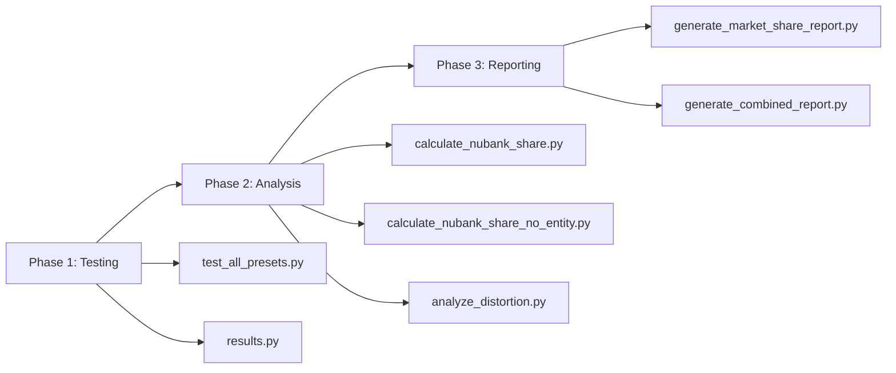
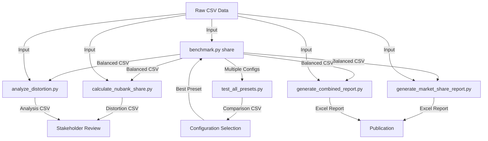

# Share Analysis Workflow Documentation

## Overview

This document provides comprehensive documentation for the share analysis workflow scripts that complement the Peer Benchmark Tool's core functionality. These scripts extend the tool's capabilities by automating preset testing, calculating market share distortion, and generating publication-ready reports for stakeholder presentations.

## Table of Contents

1. [Workflow Architecture](#workflow-architecture)
2. [Script Catalog](#script-catalog)
3. [Workflow Patterns](#workflow-patterns)
4. [Usage Examples](#usage-examples)
5. [Data Flow](#data-flow)
6. [Extension Points](#extension-points)

---

## Workflow Architecture

### Core Concept

The share analysis workflow addresses a fundamental challenge in privacy-compliant market share reporting: **how to measure and communicate the distortion introduced by privacy-balancing algorithms**.

When the Peer Benchmark Tool applies privacy constraints (k-anonymity, noise injection, volume preservation), it inflates peer volumes to satisfy regulatory requirements. This inflation changes the market share calculations:

- **Raw Share** = Entity / (Entity + Raw Peers)
- **Balanced Share** = Entity / (Entity + Balanced Peers)
- **Distortion** = Balanced Share - Raw Share

### Three-Phase Architecture



**Phase 1: Configuration Testing** - Identify optimal preset configurations  
**Phase 2: Distortion Analysis** - Quantify privacy impact on market shares  
**Phase 3: Report Generation** - Create stakeholder-ready outputs

---

## Script Catalog

### 1. test_all_presets.py

**Purpose**: Automated preset comparison and configuration optimization

**Category**: Testing & Validation

**Key Features**:
- Runs benchmark tool with all standard and custom presets
- Tests configurations with and without `--per-dimension-weights` flag
- Calculates distortion for each configuration
- Outputs comparative summary CSV

**Primary Use Case**: Determining which preset configuration minimizes market share distortion for a specific dataset

**Workflow Position**: Entry point for new datasets or when validating configuration choices

**Input Requirements**:
```python
# Required parameters
--csv              # Path to raw CSV data file
--entity           # Target entity name (e.g., "NU PAGAMENTOS SA")
--metric           # Primary metric (e.g., volume_brl)
--entity-col       # Column containing entity names
--dimensions       # Dimension column(s) to analyze
--time-col         # Time period column
--secondary-metrics # Additional metrics to track

# Optional parameters
--output-csv       # Output file for results (default: preset_comparison_results.csv)
```

**Output Artifacts**:
1. `preset_comparison_results.csv` - Distortion summary by configuration and category
2. Multiple `benchmark_share_*_balanced.csv` files - One per preset tested
3. Multiple `.xlsx` workbooks - Detailed reports per preset

**Configuration Matrix**:
The script tests the following configurations:

| Configuration | Preset | Flags | Purpose |
|--------------|--------|-------|---------|
| compliance_strict | compliance_strict | - | Zero tolerance for privacy violations |
| balanced_default | balanced_default | - | Recommended balanced approach |
| research_exploratory | research_exploratory | - | Higher tolerance for exploration |
| strategic_consistency | strategic_consistency | - | Moderate privacy/accuracy balance |
| low_distortion | low_distortion | - | Custom: minimize distortion |
| minimal_distortion | minimal_distortion | - | Custom: extremely flexible constraints |
| balanced_default+perdim | balanced_default | --per-dimension-weights | Per-category optimization |
| research_exploratory+perdim | research_exploratory | --per-dimension-weights | Exploratory with per-category |
| low_distortion+perdim | low_distortion | --per-dimension-weights | Low distortion + per-category |
| minimal_distortion+perdim | minimal_distortion | --per-dimension-weights | Minimal distortion + per-category |

**Distortion Calculation Logic**:
```python
def calculate_distortion(raw_df, balanced_df, entity, category, time_period):
    # Get entity's raw volume
    entity_raw = raw_df[
        (raw_df['issuer_name'] == entity) &
        (raw_df['function_variant'] == category) &
        (raw_df['ano_mes'] == time_period)
    ]['volume_brl'].sum()
    
    # Get raw total (all entities)
    raw_total = raw_df[
        (raw_df['function_variant'] == category) &
        (raw_df['ano_mes'] == time_period)
    ]['volume_brl'].sum()
    
    # Get balanced peer total
    balanced_peers = balanced_df[
        (balanced_df['Category'] == category) &
        (balanced_df['ano_mes'] == time_period)
    ]['volume_brl'].sum()
    
    # Calculate shares
    raw_share = (entity_raw / raw_total) * 100
    balanced_share = (entity_raw / (entity_raw + balanced_peers)) * 100
    
    # Distortion
    distortion_pp = balanced_share - raw_share
    
    return distortion_pp
```

**Typical Outputs**:
```csv
Configuration,Category,Time_Period,Raw_Share_Pct,Balanced_Share_Pct,Distortion_pp
balanced_default,Credit / Gold,2023-01-01,46.55,33.59,-12.96
balanced_default,Debit / Gold,2023-01-01,75.15,58.15,-17.00
compliance_strict,Credit / Gold,2023-01-01,46.55,33.59,-12.96
```

**Advanced Usage**:
```bash
# Test all presets for a specific dataset
py test_all_presets.py \
  --csv "data/my_data.csv" \
  --entity "MY ENTITY" \
  --metric volume_brl \
  --entity-col issuer_name \
  --dimensions function_variant \
  --time-col ano_mes \
  --secondary-metrics txn_count \
  --output-csv my_preset_comparison.csv

# Peer-only mode (no target entity)
py test_all_presets.py \
  --csv "data/my_data.csv" \
  --metric volume_brl \
  --entity-col issuer_name \
  --dimensions function_variant \
  --time-col ano_mes \
  --secondary-metrics txn_count
```

---

### 2. calculate_nubank_share.py

**Purpose**: Calculate target entity market share against balanced vs raw peer data

**Category**: Analysis

**Key Features**:
- Compares balanced market data (privacy-compliant) vs raw data (simple totals)
- Calculates distortion introduced by privacy-compliance process
- Outputs detailed CSV with share metrics and totals
- Includes both volume and transaction count denominators

**Primary Use Case**: Post-benchmark analysis to quantify privacy impact on specific entity's market position

**Workflow Position**: Executed after running benchmark tool with target entity specified

**Input Requirements**:
```python
# Hardcoded in script (modify as needed):
raw_csv_path = "data/e176097_tpv_nubank_filtered_std.csv"
balanced_csv_path = "benchmark_share_NU_PAGAMENTOS_SA_[timestamp]_balanced.csv"
entity_name = "NU PAGAMENTOS SA"
```

**Core Calculation Logic**:
```python
# For each category and time period:

# 1. Get entity's raw volumes
entity_raw_vol = raw_df[entity filter]['volume_brl'].sum()
entity_raw_cnt = raw_df[entity filter]['txn_count'].sum()

# 2. Get peer raw totals (excluding entity)
peer_raw_vol = raw_df[peers filter]['volume_brl'].sum()
peer_raw_cnt = raw_df[peers filter]['txn_count'].sum()

# 3. Get peer balanced totals
peer_balanced_vol = balanced_df['volume_brl']
peer_balanced_cnt = balanced_df['txn_count']

# 4. Calculate raw share
raw_vol_share = entity_raw_vol / (entity_raw_vol + peer_raw_vol) * 100

# 5. Calculate balanced share  
balanced_vol_share = entity_raw_vol / (entity_raw_vol + peer_balanced_vol) * 100

# 6. Calculate distortion
vol_distortion = balanced_vol_share - raw_vol_share
```

**Output Schema**:
```csv
Dimension,Category,Time_Period,
Nubank_Raw_Volume,Nubank_Balanced_Volume,
Total_Raw_Volume,Total_Balanced_Volume,
Raw_Vol_Share_Pct,Balanced_Vol_Share_Pct,Vol_Distortion_pp,
Nubank_Raw_Count,Nubank_Balanced_Count,
Total_Raw_Count,Total_Balanced_Count,
Raw_Cnt_Share_Pct,Balanced_Cnt_Share_Pct,Cnt_Distortion_pp
```

**Key Insights from Output**:
- **Total columns** show how much peers were inflated by balancing
- **Distortion columns** quantify market share impact
- **Separate volume and count metrics** reveal different distortion patterns

**Typical Use**:
```bash
# 1. Run benchmark tool first
py benchmark.py share \
  --csv "data/my_data.csv" \
  --entity "MY ENTITY" \
  --metric volume_brl \
  --preset balanced_default \
  --export-balanced-csv

# 2. Update paths in calculate_nubank_share.py
# 3. Run analysis
py calculate_nubank_share.py

# Output: nubank_share_distortion_analysis.csv
```

---

### 3. calculate_nubank_share_no_entity.py

**Purpose**: Analyze share distortion in peer-only mode (when target entity is also balanced)

**Category**: Analysis - Special Case

**Key Features**:
- Handles scenario where ALL entities (including target) are privacy-balanced
- Calculates proportional scaling factor
- Demonstrates zero-distortion configurations (e.g., low_distortion with tolerance=10)

**Primary Use Case**: Understanding peer-only balancing behavior and validating that shares are preserved under uniform scaling

**Workflow Position**: Executed after running benchmark tool WITHOUT --entity parameter

**Key Difference from calculate_nubank_share.py**:

| Aspect | With Entity | Without Entity (Peer-Only) |
|--------|-------------|---------------------------|
| Target entity treatment | Excluded from balancing | Included in balancing |
| Scaling | Peers inflated, entity unchanged | All entities scaled proportionally |
| Share distortion | Usually negative (entity share drops) | Zero (uniform scaling preserves ratios) |
| Use case | Production reporting | Validation/testing |

**Calculation Logic**:
```python
# In peer-only mode, entity is scaled same as peers

# 1. Get scale factor
scale_factor = balanced_total_vol / raw_total_vol

# 2. Calculate entity's balanced volume
entity_balanced_vol = entity_raw_vol * scale_factor

# 3. Calculate balanced share
balanced_share = entity_balanced_vol / balanced_total_vol * 100

# 4. For proportional scaling, shares are identical
# balanced_share == raw_share (distortion = 0)
```

**Critical Finding**:
When using `--per-dimension-weights` or `low_distortion` preset with tolerance, the tool can achieve 0% distortion in peer-only mode because:
1. All entities are scaled by same factor within each dimension
2. Relative proportions are preserved
3. Privacy constraints are met through category-level adjustments

**Typical Use**:
```bash
# 1. Run benchmark in peer-only mode
py benchmark.py share \
  --csv "data/my_data.csv" \
  --metric volume_brl \
  --preset low_distortion \
  --export-balanced-csv

# 2. Run analysis
py calculate_nubank_share_no_entity.py

# Output shows 0% distortion across all categories
```

---

### 4. analyze_distortion.py

**Purpose**: Comprehensive distortion analysis with summary statistics

**Category**: Analysis & Reporting

**Key Features**:
- Calculates both raw and balanced market shares
- Computes distortion across all categories and time periods
- Generates pivot tables for easy visualization
- Provides summary statistics (mean, min, max distortion)
- Outputs detailed CSV for further analysis

**Primary Use Case**: Executive summary of privacy impact across entire dataset

**Workflow Position**: Post-benchmark analysis phase, before final reporting

**Output Components**:

1. **Console Output**:
   - Volume market share distortion pivot table
   - Transaction count distortion pivot table
   - Summary statistics

2. **CSV Output** (`market_share_distortion_analysis.csv`):
   ```csv
   Year,Function,Tier,Tier_Mapped,
   Volume_Share_Raw,Volume_Share_Balanced,Volume_Distortion_pp,
   Count_Share_Raw,Count_Share_Balanced,Count_Distortion_pp
   ```

**Statistical Summary**:
```
Volume Distortion (percentage points):
  Mean: -2.83 pp
  Min:  -22.61 pp
  Max:  2.53 pp

Transaction Count Distortion (percentage points):
  Mean: -6.06 pp
  Min:  -28.81 pp
  Max:  2.91 pp
```

**Key Metrics Explained**:
- **Negative distortion**: Privacy balancing reduced entity's market share
- **Positive distortion**: Privacy balancing increased entity's market share (rare, typically in low-volume categories)
- **Large magnitude**: Indicates significant privacy impact (requires stakeholder communication)

**Tier Mapping Logic**:
```python
def map_tier(tier):
    """Aggregate Standard and Gold into single category."""
    if tier in ['Gold', 'Standard']:
        return 'Gold + Standard'
    else:
        return tier
```

**Typical Use**:
```bash
# After running benchmark
py analyze_distortion.py

# Review console output and market_share_distortion_analysis.csv
```

---

### 5. generate_market_share_report.py

**Purpose**: Generate publication-ready market share Excel report

**Category**: Reporting

**Key Features**:
- Creates formatted Excel workbook with balanced market shares
- Separate tables for volume and transaction count
- Professional styling (fonts, borders, alignment)
- Configurable for multiple years (2020-2025)
- Tier aggregation (Gold + Standard combined)

**Primary Use Case**: Creating stakeholder presentations and executive reports

**Workflow Position**: Final reporting phase after distortion has been reviewed and accepted

**Output Structure**:
```
nubank_market_share_report.xlsx
├── Sheet 1: Market Share Report
│   ├── Title: "Nubank – Market Share Estimates (volume)"
│   ├── Subtitle: "Share by Product within Mastercard Portfolio (2020-2025)"
│   ├── Table 1: Volume share by Function/Tier/Year
│   ├── (spacing)
│   ├── Title: "Nubank – Market Share Estimates (# of Transactions)"
│   ├── Subtitle: "Share by Product within Mastercard Portfolio (2020-2025)"
│   └── Table 2: Transaction count share by Function/Tier/Year
```

**Table Format**:
| Function | Tier | 2020 | 2021 | 2022 | 2023 | 2024 | 2025 |
|----------|------|------|------|------|------|------|------|
| Credit | Gold + Standard | 19% | 19% | 23% | 27% | 27% | 28% |
| Credit | Platinum | 21% | 30% | 31% | 30% | 31% | 32% |
| Credit | Black | 0% | 0% | 6% | 8% | 11% | 12% |

**Calculation Flow**:
```python
# 1. Load raw and balanced data
raw_df = pd.read_csv(raw_csv_path)
balanced_df = pd.read_csv(balanced_csv_path)

# 2. Calculate balanced shares for each category/year
for each balanced_row:
    entity_vol = get_entity_raw_volume(raw_df, category, year)
    peer_balanced_vol = balanced_row['volume_brl']
    share = entity_vol / (entity_vol + peer_balanced_vol) * 100

# 3. Create pivot table (Function, Tier) x Years
pivot = shares.pivot_table(
    index=['Function', 'Tier_Mapped'],
    columns='Year',
    values='Volume_Share_Balanced'
)

# 4. Format and export to Excel
format_excel(pivot, "Market Share Report")
```

**Styling Features**:
- **Title row**: Bold, size 14, merged across all columns
- **Subtitle row**: Italic, size 10, merged
- **Header row**: Bold, gray background, medium bottom border
- **Data cells**: Percentage formatting, right-aligned
- **Empty cells**: Dash ("-"), center-aligned
- **Function column**: Only shows when value changes (cleaner appearance)

**Customization Points**:
```python
# In main():
raw_csv_path = "your_raw_data.csv"
balanced_csv_path = "your_balanced_output.csv"
output_path = "your_report_name.xlsx"
entity = "YOUR ENTITY NAME"
time_col = "your_time_column"  # 'ano' for yearly, 'ano_mes' for monthly
```

**Typical Workflow**:
```bash
# 1. Run benchmark
py benchmark.py share --csv data.csv --entity "ENTITY" --metric volume_brl --export-balanced-csv

# 2. Update paths in generate_market_share_report.py

# 3. Generate report
py generate_market_share_report.py

# 4. Open nubank_market_share_report.xlsx
```

---

### 6. generate_combined_report.py

**Purpose**: Comprehensive Excel report with both market shares AND distortion analysis

**Category**: Reporting - Advanced

**Key Features**:
- Single workbook with 4 worksheets
- Balanced shares (volume & count)
- Distortion analysis (volume & count)
- Professional formatting with distinct styling for shares vs distortion
- Complete audit trail for stakeholder review

**Primary Use Case**: Executive reporting package that shows both final numbers and their derivation

**Workflow Position**: Final reporting phase when full transparency is required

**Workbook Structure**:
```
nubank_market_share_complete_report.xlsx
├── Sheet 1: "Volume Share"
│   └── Balanced market shares by volume (%)
├── Sheet 2: "Count Share"
│   └── Balanced market shares by transaction count (%)
├── Sheet 3: "Volume Distortion"
│   └── Balanced - Raw volume share (pp)
└── Sheet 4: "Count Distortion"
    └── Balanced - Raw count share (pp)
```

**Key Differentiator from generate_market_share_report.py**:

| Feature | generate_market_share_report.py | generate_combined_report.py |
|---------|--------------------------------|----------------------------|
| Sheets | 1 | 4 |
| Content | Balanced shares only | Shares + Distortion |
| Audience | General stakeholders | Technical/executive review |
| Formatting | Percentages | Percentages + pp (percentage points) |
| Use case | Publication | Analysis + publication |

**Distortion Formatting**:
```python
# For distortion sheets:
if value > 0:
    cell.value = f"+{int(value)} pp"  # Positive distortion
else:
    cell.value = f"{int(value)} pp"   # Negative distortion (includes minus sign)
```

**Complete Data Flow**:
```python
def calculate_all_shares(raw_df, balanced_df):
    """Single function calculates everything needed for all sheets."""
    
    for each category/year:
        # Raw calculations
        raw_total_vol = all_entities_raw_volume
        raw_share = entity / raw_total * 100
        
        # Balanced calculations
        balanced_total_vol = entity + balanced_peers
        balanced_share = entity / balanced_total * 100
        
        # Distortion
        distortion = balanced_share - raw_share
        
        store {
            'Volume_Share_Raw': raw_share,
            'Volume_Share_Balanced': balanced_share,
            'Volume_Distortion_pp': distortion,
            'Count_Share_Raw': ...,
            'Count_Share_Balanced': ...,
            'Count_Distortion_pp': ...
        }
    
    return DataFrame
```

**Typical Use**:
```bash
# After running benchmark
py generate_combined_report.py

# Creates nubank_market_share_complete_report.xlsx
# Contains everything needed for stakeholder review
```

---

### 7. results.py

**Purpose**: Ad-hoc analysis and validation script

**Category**: Utility / Debugging

**Key Features**:
- Flexible script for quick data exploration
- Used for validating benchmark outputs
- Comparing preset results
- Investigating root causes of distortion
- No fixed structure - modified for each analysis need

**Primary Use Case**: Interactive analysis during workflow development and troubleshooting

**Workflow Position**: Used throughout all phases as needed for validation

**Typical Modifications**:

**Example 1: Validate Entity Exclusion**
```python
# Confirm target entity is not in peer group
raw_df = pd.read_csv('data.csv')
balanced_df = pd.read_csv('balanced.csv')

entities_in_raw = raw_df['issuer_name'].unique()
print(f"Nubank in raw data: {'NU PAGAMENTOS SA' in entities_in_raw}")

# Balanced data should only have aggregated peers
print(f"Rows in balanced: {len(balanced_df)}")  # Should be categories x time_periods
print(balanced_df['Category'].unique())
```

**Example 2: Compare Preset Outputs**
```python
# Load two preset outputs
balanced_default = pd.read_csv('balanced_default_output.csv')
research_exploratory = pd.read_csv('research_exploratory_output.csv')

# Compare volumes
comparison = pd.merge(
    balanced_default[['Category', 'ano_mes', 'volume_brl']],
    research_exploratory[['Category', 'ano_mes', 'volume_brl']],
    on=['Category', 'ano_mes'],
    suffixes=('_default', '_exploratory')
)

comparison['difference'] = comparison['volume_brl_default'] - comparison['volume_brl_exploratory']
print(comparison[comparison['difference'] != 0])
```

**Example 3: Investigate Distortion Root Cause**
```python
# For category with high distortion, analyze peer distribution
category = "Debit / Gold"
raw_peers = raw_df[
    (raw_df['function_variant'] == category) &
    (raw_df['issuer_name'] != 'NU PAGAMENTOS SA')
]

peer_concentration = raw_peers.groupby('issuer_name')['volume_brl'].sum()
print("\nPeer Concentration:")
print(peer_concentration.sort_values(ascending=False))

# High concentration in few peers = higher privacy inflation needed
```

**Usage Pattern**:
```bash
# Modify results.py for specific analysis
# Run to investigate
py results.py

# Review console output
# Modify again for next question
```

---

## Workflow Patterns

### Pattern 1: New Dataset Validation

**Scenario**: You have a new dataset and need to determine the best configuration

**Steps**:
```bash
# 1. Test all presets
py test_all_presets.py \
  --csv "data/new_dataset.csv" \
  --entity "TARGET ENTITY" \
  --metric volume_brl \
  --entity-col issuer_name \
  --dimensions function_variant \
  --time-col ano_mes \
  --secondary-metrics txn_count \
  --output-csv new_dataset_preset_comparison.csv

# 2. Review preset_comparison.csv
# Identify configuration with lowest distortion

# 3. Re-run with best preset with export-balanced-csv
py benchmark.py share \
  --csv "data/new_dataset.csv" \
  --entity "TARGET ENTITY" \
  --metric volume_brl \
  --preset [best_preset] \
  --export-balanced-csv

# 4. Generate detailed analysis
py calculate_nubank_share.py  # (update paths first)
py analyze_distortion.py

# 5. Create stakeholder report
py generate_combined_report.py
```

### Pattern 2: Monthly Reporting Workflow

**Scenario**: Regular monthly market share reporting

**Steps**:
```bash
# 1. Previous analysis established balanced_default is optimal
py benchmark.py share \
  --csv "data/monthly_data_2025_11.csv" \
  --entity "TARGET ENTITY" \
  --metric volume_brl \
  --preset balanced_default \
  --export-balanced-csv

# 2. Generate publication report
py generate_market_share_report.py

# 3. Archive outputs
# - nubank_market_share_report.xlsx → share with stakeholders
# - benchmark_share_*_balanced.csv → retain for audit
```

### Pattern 3: Configuration Troubleshooting

**Scenario**: Distortion is too high in certain categories

**Steps**:
```bash
# 1. Investigate with results.py
# Modify to analyze peer concentration
py results.py

# 2. Test aggressive custom preset
# Modify presets/custom.yaml with tighter constraints
py test_all_presets.py --csv data.csv --entity ENTITY ...

# 3. Compare results
# Review preset_comparison.csv for improvements

# 4. If still high, analyze root cause
py analyze_distortion.py
# Review which categories have highest distortion

# 5. Consider data refinement
# - Subset analysis (exclude problematic categories)
# - Time period aggregation (monthly → quarterly)
# - Tier consolidation (combine Standard + Gold)
```

### Pattern 4: Peer-Only Validation

**Scenario**: Validate that peer-only balancing preserves shares

**Steps**:
```bash
# 1. Run peer-only benchmark
py benchmark.py share \
  --csv "data/data.csv" \
  --metric volume_brl \
  --preset low_distortion \
  --export-balanced-csv
  # Note: no --entity parameter

# 2. Analyze peer-only shares
py calculate_nubank_share_no_entity.py

# Expected: 0% distortion across all categories
# Confirms proportional scaling
```

---

## Data Flow

### Complete End-to-End Flow



### File Dependencies

**Input Files**:
- `data/*.csv` - Raw transaction data with columns:
  - `issuer_name` - Entity identifier
  - `volume_brl` - Volume metric
  - `txn_count` - Transaction count
  - `function_variant` - Category dimension
  - `ano_mes` or `ano` - Time period

**Intermediate Files**:
- `benchmark_share_*_balanced.csv` - Privacy-balanced peer totals
- `benchmark_share_*.xlsx` - Detailed benchmark reports
- `preset_comparison_results.csv` - Multi-configuration comparison

**Output Files**:
- `nubank_share_distortion_analysis.csv` - Detailed share analysis
- `market_share_distortion_analysis.csv` - Comprehensive distortion metrics
- `nubank_market_share_report.xlsx` - Publication-ready shares
- `nubank_market_share_complete_report.xlsx` - Shares + distortion package

### Schema Requirements

**Raw CSV Schema**:
```
issuer_name,volume_brl,txn_count,function_variant,ano_mes
NU PAGAMENTOS SA,1000000.0,5000,Credit / Gold,2023-01-01
BANCO ITAU SA,2000000.0,10000,Credit / Gold,2023-01-01
...
```

**Balanced CSV Schema** (output by benchmark.py):
```
Dimension,Category,ano_mes,volume_brl,txn_count
function_variant,Credit / Gold,2023-01-01,3500000.0,17500
function_variant,Debit / Platinum,2023-01-01,1200000.0,8000
...
```

Note: Balanced CSV contains aggregated peer totals, NOT entity-level data

---

## Extension Points

### Adding New Preset Configurations

**Location**: `test_all_presets.py` - CONFIGURATIONS list

```python
CONFIGURATIONS = [
    # ... existing presets ...
    
    # Add new custom preset
    {
        "name": "my_custom_preset",
        "preset": "my_custom_preset",  # Must exist in presets/ directory
        "flags": ["--per-dimension-weights"]  # Optional flags
    },
]
```

Then create `presets/my_custom_preset.yaml`:
```yaml
version: "3.0"
preset_name: "my_custom_preset"
description: "Custom configuration for specific use case"

optimization:
  bounds:
    max_weight: 2.0
    min_weight: 0.5
  
  linear_programming:
    tolerance: 5.0
  
  # ... additional parameters
```

### Adding New Analysis Metrics

**Location**: `calculate_nubank_share.py` or create new script

```python
# Example: Add median absolute deviation metric

def calculate_mad_distortion(distortion_series):
    """Calculate median absolute deviation of distortion."""
    median_dist = distortion_series.median()
    mad = (distortion_series - median_dist).abs().median()
    return mad

# Add to results DataFrame
results['MAD_Distortion'] = calculate_mad_distortion(results['Vol_Distortion_pp'])
```

### Supporting New Time Granularities

**Current**: Monthly (`ano_mes: 2023-01-01`) and Yearly (`ano: 2023`)

**Extension for Quarterly**:

```python
# In generate_market_share_report.py or calculate_nubank_share.py

def aggregate_to_quarterly(df, time_col='ano_mes'):
    """Aggregate monthly data to quarters."""
    df = df.copy()
    df['quarter'] = pd.to_datetime(df[time_col]).dt.to_period('Q')
    
    quarterly = df.groupby(['issuer_name', 'function_variant', 'quarter']).agg({
        'volume_brl': 'sum',
        'txn_count': 'sum'
    }).reset_index()
    
    return quarterly

# Use in workflow:
raw_df = load_data(raw_csv)
raw_quarterly = aggregate_to_quarterly(raw_df)
# Then proceed with normal analysis
```

### Adding New Report Formats

**Location**: Create new `generate_*_report.py` script

**Example: PowerPoint Report Generator**:

```python
# generate_ppt_report.py

from pptx import Presentation
from pptx.util import Inches, Pt

def create_ppt_report(shares_df, distortion_df, output_path):
    """Generate PowerPoint presentation with charts."""
    prs = Presentation()
    
    # Slide 1: Title
    title_slide = prs.slides.add_slide(prs.slide_layouts[0])
    title = title_slide.shapes.title
    subtitle = title_slide.placeholders[1]
    title.text = "Market Share Analysis"
    subtitle.text = "Privacy-Balanced Results"
    
    # Slide 2: Market Share Table
    # ... pivot table as PowerPoint table
    
    # Slide 3: Distortion Chart
    # ... bar chart of distortion by category
    
    prs.save(output_path)
```

### Supporting Multi-Entity Analysis

**Current**: Single target entity

**Extension**: Compare multiple entities

```python
# calculate_multi_entity_share.py

def calculate_all_entities(raw_df, balanced_df, entities_list):
    """Calculate shares for multiple entities."""
    results = []
    
    for entity in entities_list:
        entity_results = calculate_shares_for_entity(raw_df, balanced_df, entity)
        entity_results['Entity'] = entity
        results.append(entity_results)
    
    return pd.concat(results)

# Usage:
entities = ["NU PAGAMENTOS SA", "BANCO BRADESCO S.A.", "BANCO ITAU S.A."]
multi_entity_results = calculate_all_entities(raw_df, balanced_df, entities)
```

### Automation via Scheduling

**Pattern**: Monthly automated reporting

```python
# scheduled_workflow.py

import schedule
import time
from pathlib import Path
from datetime import datetime
import subprocess

def monthly_report_workflow():
    """Automated monthly market share reporting."""
    
    # 1. Fetch latest data (placeholder)
    data_file = fetch_monthly_data()  # Your data retrieval logic
    
    # 2. Run benchmark
    subprocess.run([
        "py", "benchmark.py", "share",
        "--csv", str(data_file),
        "--entity", "NU PAGAMENTOS SA",
        "--metric", "volume_brl",
        "--preset", "balanced_default",
        "--export-balanced-csv"
    ])
    
    # 3. Generate reports
    subprocess.run(["py", "generate_market_share_report.py"])
    subprocess.run(["py", "analyze_distortion.py"])
    
    # 4. Archive outputs
    timestamp = datetime.now().strftime("%Y%m%d")
    archive_dir = Path(f"archive/{timestamp}")
    archive_dir.mkdir(exist_ok=True)
    
    # Move reports to archive
    # ... copy/move logic
    
    # 5. Send notification
    send_email_notification(archive_dir)  # Your email logic

# Schedule monthly on the 5th at 9 AM
schedule.every().month.at("09:00").do(monthly_report_workflow)

while True:
    schedule.run_pending()
    time.sleep(3600)  # Check hourly
```

### Custom Distortion Thresholds

**Pattern**: Alert when distortion exceeds tolerance

```python
# distortion_alerting.py

def check_distortion_thresholds(distortion_df, thresholds):
    """
    Validate distortion against acceptable thresholds.
    
    Args:
        distortion_df: DataFrame with distortion analysis
        thresholds: Dict of {category: max_acceptable_distortion_pp}
    
    Returns:
        List of violations
    """
    violations = []
    
    for category, max_distortion in thresholds.items():
        cat_data = distortion_df[distortion_df['Category'] == category]
        
        for _, row in cat_data.iterrows():
            if abs(row['Vol_Distortion_pp']) > max_distortion:
                violations.append({
                    'Category': category,
                    'Time': row['Time_Period'],
                    'Distortion': row['Vol_Distortion_pp'],
                    'Threshold': max_distortion
                })
    
    return violations

# Usage:
thresholds = {
    'Credit / Gold': 15.0,    # Acceptable: up to 15pp distortion
    'Debit / Gold': 20.0,
    'Credit / Platinum': 10.0,
    'Debit / Platinum': 5.0,
    'Credit / Black': 5.0,
    'Debit / Black': 5.0
}

violations = check_distortion_thresholds(distortion_df, thresholds)

if violations:
    print("WARNING: Distortion threshold violations detected!")
    for v in violations:
        print(f"  {v['Category']} at {v['Time']}: {v['Distortion']:.1f}pp (threshold: {v['Threshold']:.1f}pp)")
```

---

## Best Practices

### 1. Version Control

**Recommendation**: Track preset configurations and output files

```bash
# .gitignore additions
data/*.csv
benchmark_share_*.csv
benchmark_share_*.xlsx
*.pyc
__pycache__/

# But DO track:
# - All .py scripts
# - presets/*.yaml
# - Sample outputs (for documentation)
```

### 2. File Naming Conventions

**Pattern**: Include timestamp, entity, and preset in output files

```python
from datetime import datetime

timestamp = datetime.now().strftime("%Y%m%d_%H%M%S")
entity_clean = entity.replace(" ", "_").replace(".", "")
preset_name = "balanced_default"

output_file = f"market_share_{entity_clean}_{preset_name}_{timestamp}.xlsx"
```

### 3. Logging and Audit Trail

**Pattern**: Log all workflow executions

```python
import logging

logging.basicConfig(
    filename=f'workflow_log_{datetime.now().strftime("%Y%m%d")}.log',
    level=logging.INFO,
    format='%(asctime)s - %(levelname)s - %(message)s'
)

logging.info(f"Starting preset comparison: {csv_path}")
logging.info(f"Entity: {entity}, Metric: {metric}")
# ... during workflow
logging.info(f"Distortion range: {min_dist:.2f} to {max_dist:.2f} pp")
```

### 4. Data Validation

**Pattern**: Validate inputs before processing

```python
def validate_raw_csv(df, required_cols):
    """Validate raw CSV has required structure."""
    missing_cols = set(required_cols) - set(df.columns)
    if missing_cols:
        raise ValueError(f"Missing required columns: {missing_cols}")
    
    if df['volume_brl'].isna().any():
        raise ValueError("Null values in volume_brl column")
    
    if len(df) == 0:
        raise ValueError("Empty dataset")
    
    return True

# Usage:
required_cols = ['issuer_name', 'volume_brl', 'txn_count', 'function_variant', 'ano_mes']
validate_raw_csv(raw_df, required_cols)
```

### 5. Performance Optimization

**Pattern**: Cache intermediate results for large datasets

```python
from functools import lru_cache
import pickle

@lru_cache(maxsize=128)
def get_category_totals(csv_path, category, time_period):
    """Cached category total calculation."""
    df = pd.read_csv(csv_path)
    subset = df[(df['function_variant'] == category) & (df['ano_mes'] == time_period)]
    return subset['volume_brl'].sum(), subset['txn_count'].sum()

# Or use pickle for complex DataFrames:
def cache_dataframe(df, cache_file):
    """Save DataFrame to pickle for faster loading."""
    with open(cache_file, 'wb') as f:
        pickle.dump(df, f)

def load_cached_dataframe(cache_file):
    """Load DataFrame from pickle."""
    with open(cache_file, 'rb') as f:
        return pickle.load(f)
```

---

## Troubleshooting Guide

### Issue: Distortion Exceeds Acceptable Threshold

**Symptoms**: Market share distortion > 20pp in multiple categories

**Diagnosis**:
```python
# Use results.py to investigate
raw_df = pd.read_csv('data.csv')

# Check entity dominance
entity_share = raw_df[raw_df['issuer_name'] == 'TARGET']['volume_brl'].sum() / raw_df['volume_brl'].sum()
print(f"Entity's raw market share: {entity_share*100:.1f}%")

# If > 40%, privacy constraints will require significant peer inflation
```

**Solutions**:
1. **Data aggregation**: Combine categories to reduce dominance
2. **Time period expansion**: Use quarterly instead of monthly
3. **Preset adjustment**: Use `low_distortion` or `minimal_distortion`
4. **Accept higher distortion**: Document and communicate to stakeholders

### Issue: Balanced CSV Does Not Match Expected Schema

**Symptoms**: Script errors referencing missing columns

**Diagnosis**:
```python
balanced_df = pd.read_csv('balanced.csv')
print(balanced_df.columns.tolist())
print(balanced_df.head())
```

**Solutions**:
1. Verify benchmark.py ran with `--export-balanced-csv` flag
2. Check file path in analysis script matches actual output
3. Confirm benchmark completed successfully (check logs)

### Issue: Test All Presets Takes Too Long

**Symptoms**: test_all_presets.py runs for hours

**Diagnosis**: Large dataset × many presets × complex dimensions

**Solutions**:
1. **Reduce configurations**: Test only most relevant presets
2. **Subset data**: Test with 3-6 months instead of full dataset
3. **Parallel execution**: Modify script to run presets in parallel (advanced)

```python
# Quick test with fewer presets:
CONFIGURATIONS = [
    {"name": "balanced_default", "preset": "balanced_default", "flags": []},
    {"name": "low_distortion", "preset": "low_distortion", "flags": []},
]
```

### Issue: Excel Report Formatting Issues

**Symptoms**: Columns too narrow, merged cells incorrect

**Diagnosis**: Column count mismatch between title merge and actual data

**Solutions**:
```python
# In format_sheet() function:
num_cols = 2 + len(pivot_df.columns)  # Ensure accurate count
ws.merge_cells(start_row=1, start_column=1, end_row=1, end_column=num_cols)

# Verify with:
print(f"Pivot columns: {pivot_df.columns.tolist()}")
print(f"Merging to column: {num_cols}")
```

---

## Future Enhancement Roadmap

### Near-Term (1-3 months)

1. **Configuration Wizard**
   - Interactive script to guide preset selection
   - Based on dataset characteristics (size, dominance, frequency)

2. **Dashboard Interface**
   - Web-based dashboard for running workflows
   - Real-time monitoring of benchmark progress
   - Interactive distortion visualization

3. **Automated Quality Checks**
   - Pre-run validation of data quality
   - Post-run distortion threshold checking
   - Automated flagging of anomalies

### Mid-Term (3-6 months)

1. **Multi-Metric Optimization**
   - Joint optimization across volume AND count
   - Trade-off analysis between metrics
   - Pareto frontier visualization

2. **Scenario Analysis**
   - What-if analysis: "What distortion if entity share was X%?"
   - Sensitivity testing for privacy parameters
   - Monte Carlo simulation for uncertainty quantification

3. **API Integration**
   - RESTful API for triggering workflows
   - Webhook notifications on completion
   - Integration with existing business intelligence tools

### Long-Term (6-12 months)

1. **Machine Learning Optimization**
   - ML model to predict optimal preset based on dataset features
   - Automated parameter tuning
   - Continuous learning from historical runs

2. **Real-Time Streaming**
   - Support for continuous data ingestion
   - Rolling window analysis
   - Incremental privacy balancing

3. **Multi-Jurisdiction Support**
   - Configurable privacy rules by region
   - Currency conversion and normalization
   - Cross-border market share analysis

---

## Appendix

### A. Complete Parameter Reference

**benchmark.py share parameters** (used by all scripts):

| Parameter | Required | Description | Example |
|-----------|----------|-------------|---------|
| `--csv` | Yes | Path to raw CSV data | `data/my_data.csv` |
| `--entity` | No | Target entity name | `"NU PAGAMENTOS SA"` |
| `--metric` | Yes | Primary metric column | `volume_brl` |
| `--entity-col` | Yes | Column with entity names | `issuer_name` |
| `--dimensions` | Yes | Dimension column(s) | `function_variant` |
| `--time-col` | Yes | Time period column | `ano_mes` or `ano` |
| `--secondary-metrics` | No | Additional metrics | `txn_count` |
| `--preset` | No | Preset configuration | `balanced_default` |
| `--export-balanced-csv` | No | Export balanced data | (flag, no value) |
| `--per-dimension-weights` | No | Per-category optimization | (flag, no value) |

### B. Environment Setup

**Required Python Packages**:
```txt
pandas>=1.5.0
openpyxl>=3.0.0
numpy>=1.20.0
```

**Installation**:
```bash
pip install pandas openpyxl numpy
```

### C. Glossary

**Terms and Definitions**:

- **Balanced Data**: Privacy-compliant peer volumes after weight optimization
- **Raw Data**: Unmodified transaction volumes from source
- **Distortion**: Difference between balanced and raw market shares (in percentage points)
- **Entity**: Target organization being benchmarked (excluded from peer group)
- **Peer Group**: All other organizations used for comparison
- **Preset**: Pre-configured set of privacy and optimization parameters
- **Share**: Market share percentage = Entity / (Entity + Peers) × 100
- **Tier**: Cardholder segment (e.g., Gold, Platinum, Black)
- **Function**: Transaction type (e.g., Credit, Debit)
- **Category**: Combination of function and tier (e.g., "Credit / Gold")
- **Volume**: Transaction value in currency units
- **Count**: Number of transactions
- **pp**: Percentage points (absolute difference, not relative percent change)

---

**Document Version**: 1.0  
**Last Updated**: 2026-01-27  
**Maintainer**: Analytics Team  
**Related Documentation**: 
- [Peer Benchmark Tool README](README.md)
- [Privacy Configuration Guide](PRIVACY_CONFIG.md)
- [CSV Validator Documentation](utils/CSV_VALIDATOR_README.md)
